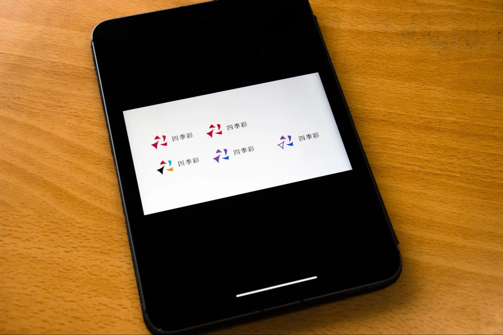

菁々祭の顔、と聞いてロゴを思い浮かべる人も多いのではないでしょうか？ そんな菁々祭のロゴは、なんと生徒によって作られているのです！毎年クオリティが高くてすごいですよね。今回はなんと第 58 回菁々祭と第 59 回菁々祭のロゴデザインを手掛けた製作セクション長にお話を聞いてきました。

# 目次

# Q.「まずどうしてロゴデザインをしようと思ったのですか？」

「もちろんデザインに関する興味というのはもともとあって、デザイン自体には慣れていたんですけど。ただロゴデザインっていうのはなかなか機会がないというか。新しい経験だったし、ハードルに感じる部分はあったけどやってみようかなって。それでやってみたって感じですね。」

# Q.「初めてのロゴデザインで特に大変だったことは何ですか？」

「そうですね。中学三年生で製作セクション員になって、次の年にいきなりセクション長を任されたんですよね。だから、どう振る舞っていいかとか分からないままロゴデザインの業務を始めることになって。

とりあえず Discord で会議して、10 以上あった案の中から俺の案に決まったんですよね。でもその案で本当にいいのかどうか自分の中で疑心暗鬼になって、それで二週間くらい悩んで。それで自分でもう一個作り直して、みたいなのをしていました。」

第 58 回菁々祭「四季彩」の初期ロゴ案

## 「自分の案に自信を持てなくなったってことですね？」

「そうです。Discord で会議するんですけど、オンライン上でのやりとりじゃないですか。だから自分がセクション長だから否定しづらい空気になってるんじゃないかとか思いはじめちゃって。あとやっぱり顔が見えないから、表情とかわからないんですよね。だからこの案で本当に大丈夫なのかな、って思うようになったんですよね。」

## 「じゃあやっぱり、前回のロゴは後悔も多いんですか？」

「『四季彩』のロゴでは万人に愛されるようなテイストを目指していたんですよね。でも逆に個性みたいな、なんかそういうものがあまり出せなかったっていうような気もしてて。目指しすぎたっていうのがあったかもしれないですね。これが前回の反省かな？」

「なるほど。気をつけたことが裏目に出たって感じですね。」

# Q.「今年のロゴに変化はありましたか？」

「二年連続で同じ人が作ったっていうのは、多分今までなくて。だからその経験を生かしたいなとも思ったし、あと同じ人間が作ると似通ったデザインになりがちだから、同じテイストで終わらせたくないなってのがあって。ちょっとそこは意識的にイメージを変えて制作しました。」

「確かに菁々祭のロゴは毎年違った個性が求められますからね。」

「ええ、ここ数年ずっと平面的なロゴ、いわゆるフラットデザインが主だったんですよ。だから、それを踏まえて今回のロゴはあえて変えていきたいなと思って。それで 3DCG みたいな、新しい表現として立体的なデザインをできるように意識しましたね。」

第 59 回菁々祭「RESONANCE」ロゴの構想

## 「今までにない表現ですね。でも随分攻めた表現にした分やっぱり緊張しますか？」

「そうですね。前回より攻めたデザインにしたという感覚がある分、反応ってのはどうしても気になってしまうし、不特定多数に見られるので怖いなって思う時もあります。ただ、一方で少し楽しみに思っているところもあります。」

「やっぱり菁々祭のデザインの根幹に関わることができますからね。」

# Q.「最後に将来のロゴを作る後輩達へのメッセージをお願いします。」

「ロゴデザインするにあたって悩んだり、あるいは自信を失ってしまったりするかもしれません。でも、菁々祭の顔になるものを作れるっていうのは、やっぱりすごくやりがいがあるし、光栄なことだと思っています。だからこそ、迷ったときも『俺が次の菁々祭を背負っていく』という強い意志を持って突き進んでくれたらなと思います。」

# まとめ

いかがだったでしょうか？今回は製作セクション長にお話を伺いました！ロゴデザインってとっても難しいんですね…。是非みなさんにもロゴに数々の思いが込められていることを知っていただければ嬉しいです！
