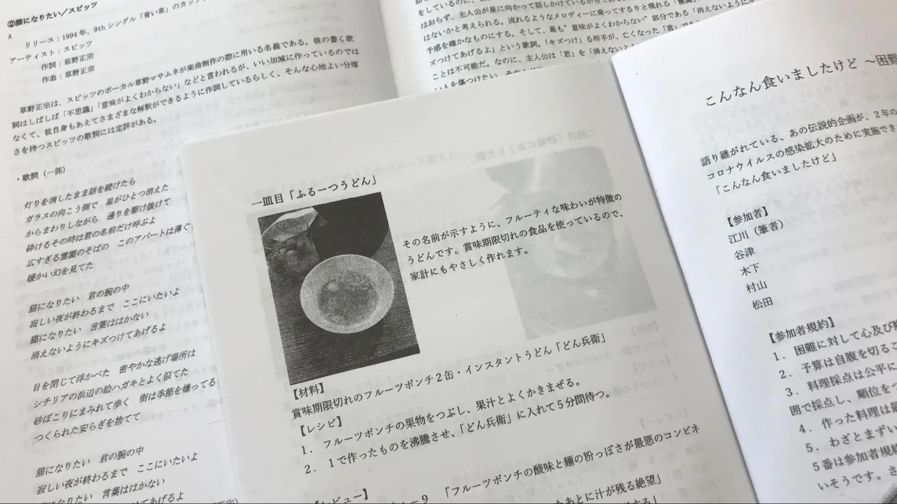

菁々祭をより良いものにするために、各文化部が発行している部誌は欠かせません。その内容は部活によって様々ですが、どれも興味深いものばかりです。また、それらの執筆、編集、印刷、製本は全て生徒が行うため、一つの部誌が菁々祭で配布されるまでには膨大な手間ひまがかけられています。

# 目次

# Q.番茶党って、どんな部誌なんですか？

他のクラブは、クラブの活動内容に関する部誌を発行しますが、新聞部は菁菁新聞文化祭号がその役割を担っています。そのため、番茶党では新聞とは全く関係なく、新聞部員が自分の書きたいことを自由に書きます。つまり、一般的な部誌が専門雑誌だとすれば、番茶党は総合雑誌です。内容が浅いという意味ではありません。各部員が本当に書きたくて書いた記事の集まりであるため、密度が圧倒的に高いのです。そこには野球も音楽も、哲学もあります。番茶党は、東大寺学園生の青春そのものなのです。
また、番茶党について語るうえで、恒例企画の「こんなん食いましたけど〜困難悔いましたけど〜」（通称「こんくい」）は避けて通れません。新聞部員が自分たちの自作料理を食べて料理を味・芸術性の 2 つの観点から採点するグルメな企画ですが、そこに登場するのは奇妙な料理ばかりです。いくつかルールがありますが、なかでも「わざとまずいものを作らない」というルールは守られたことがなく、名前を聞くだけで食欲を失ってしまうような恐ろしい料理が続出します。コロナ禍で開催を自粛した年もありましたが、今年は実施する予定です。どんな珍料理が最高得点に輝くか、ご自身の目でお確かめください。

# Q.番茶党は大変人気だと聞きましたが。

嬉しいことにとても人気で、毎年のように 1 日目が終了する時点でほとんど残部がなくなり、2 日目の朝に増刷して製本する事態になっています。

# Q.新聞部はかなり歴史が長い部活ですが、番茶党も長いんですか？

東大寺学園で最も古くからある新聞部ですが、番茶党は比較的新しく、今年で 37 年目です。ちょうど東大寺の境内から現在の校舎に移転した年に創刊された計算になります。もちろん、他のクラブの部誌よりは歴史が長いほうだと思いますが、普段から旧校舎時代や菁々中学時代の新聞に親しんでいる新聞部員にとっては「今様」なのです。

# Q.去年の番茶党について教えてください。

去年は部員数が少なく、部誌として成立しないのではないかと危ぶまれましたが、全部員が記事を執筆し、さらに 2 名から寄稿があったため、思いのほか充実した番茶党になりました。例年よりもクオリティの高い記事が多かったように感じます。しかし、「こんくい」が実施できなかったのは残念でなりません。
また、編集者としては、締め切りまでに 1 人しか原稿を提出してくれなかったため、編集の予定が大幅に遅れて文化祭直前まで完成せず、菁菁新聞文化祭号の制作の仕事も重なり、寝不足に苦しみました。結局、番茶党は間に合いましたが、新聞は 1 日目には完成せず、2 日目しか配布できませんでした。

一昨年の「こんくい」(手前)。昨年の号(奥)では実施できなかった。

# Q.今年の番茶党はどのようなものにしたいですか。

去年の反省を活かし、今年は早めに記事を書いてもらうつもりですが、最後まで何が起こるか分からないのが番茶党。編集者に求められるのは、機転と発想です。突然の寄稿にも部員の無理難題にも全力で対応し、必ずや最高の番茶党に仕上げましょう。先の見えない現代社会です。実際に番茶党を手に取って、その波瀾を全身で感じてください。

# ありがとうございました。

いかがだったでしょうか。部誌ひとつとっても、部員それぞれの魅力が詰まっているように感じます。部誌を発行しているのは新聞部だけではありません。今年の夏はぜひ、色々な部誌を手にとって、それぞれの部員が繰り広げる世界に浸ってみてください。
まずは去年の番茶党をチェック！

[番茶党第 36 号（2022 年発行）.pdf](%E7%95%AA%E8%8C%B6%E5%85%9A%E7%AC%AC36%E5%8F%B7%EF%BC%882022%E5%B9%B4%E7%99%BA%E8%A1%8C%EF%BC%89.pdf)
