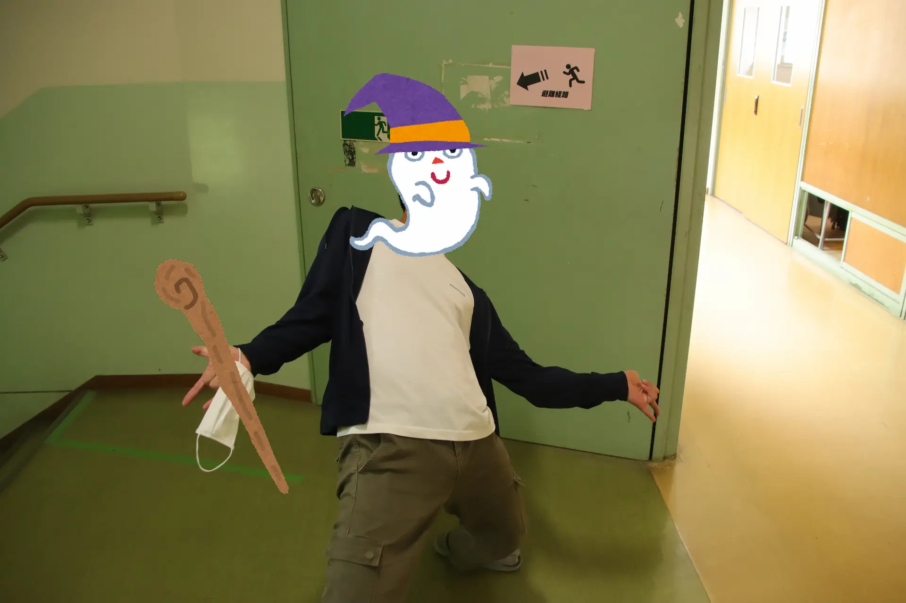

菁々祭の中でも特に内容が秘匿されたブース、お化け屋敷。今回の取材では、校舎の片隅で暗幕に包まれた実情、さらにはそのまとめ役について、前回と今回のトップであるお化け屋敷セクション長に話を伺いました。

# 目次

## まずは今回のお化け屋敷セクション長にお聞きしました。

# Q.菁々祭の中で、お化け屋敷とはどういったコンテンツでしょうか

チケットも完売する事がほとんどで、菁々祭に欠かせない催しだと自負しています。多くの人に来ていただけるよう、より高いクオリティを目指し制作しています。

# Q.お化け屋敷の夏休み中の作業について教えてください

まずは前年度に使用した木材を整理するところから始まります。夏休みまでには設計図を作成し、期末試験が終わる 7 月中旬ごろから組み立て作業が始まります。夏休み中は設計図通りに木を切ることがメインで、組み上げるのは夏休み終盤からになります。というのは、お化け屋敷の使用教室では夏休みの間高校三年生の補習が行われているためなのですが、これは中々スケジュール的にキツイものがあると思っています。

# Q.主にどのような方が関わっていらっしゃるのでしょうか

セクション長の私と副セクション長の「丸顔」「終焉のポップコーン」(ニックネームです)を中心に優秀な人材が揃っています。新規加入のメンバーも多く、新しい意見を参考にしながら作業を進めていける事が今年の特色だと考えています。

変な踊りを見せる今年度のセクション長 1

## さらに前回のセクション長にもお聞きしました。

# Q.お化け屋敷セクションにはいつから参加していたのでしょうか

中学三年生までは野球に打ち込んでいて、菁々祭の運営には全く関わっていませんでした。野球部を辞めた高校一年生の時に、どこかしらへの所属が義務なのだと誤解して、ヒラのセクション員として加入しました。そして昨年は他の幾つかのパートと兼任しながら、お化け屋敷のセクション長として働きました。

# Q.第 58 回のお化け屋敷にて、最も大変だったことは何でしょうか

例年 4 月末に予算案の提出締切があるのですが、昨年はその日が中学一斉検診で、半日で授業が終わったんです。放課後に 4,５人で集まって予め拵えてあった設計図から必要な木材の量を数え、終わった後はそのまま遊んでいました。その中の一人が設計図を見返してふと、「こことここ、どうなってんの？」と言って、、、。それが下校時刻の迫った 17 時で、それからイオンのフードコートに移動して 20 時か 21 時まで作業していました。自業自得ですが、その時が一番大変でした。また、校舎の工事の関係でプレハブ小屋が出来るなどで資材置き場が頻繫に変わり、その度に木材を運ぶのも時間が掛かってしんどかったです。

# Q.最も後悔していることは何でしょうか

後輩に向けて手順や注意点を纏めたマニュアルを作ってやったら良かった、と思っています。あとは、道具や金具に関しての見通しが甘く、方々に迷惑をかけてしまったこともありました。

# Q.では逆に、最も嬉しかったことは何でしょうか

完成した瞬間が一番喜びが大きかったです。お化け屋敷は演習室 B,C で制作するのですが、C は前年のを大きく引用したもの、B は独自の設計を特に盛り込んだもので、それぞれ別種の感動がありました。

# Q.今年のセクション長はどういった方でしょうか

彼は中学三年生から加入してくれてて、お化け屋敷運営の上で大事なこともわかっていますし、去年もセクション員の皆をよくまとめてくれていました。礼儀もしっかりしているので心配は全くありません。

変な踊りを見せる今年度のセクション長 2

# Q.第 59 回には何を期待しますか

お化け屋敷は菁々祭の中でも人気イベントなので、どれだけ出来が悪くてもお客さんが来ます。しかしだからこそ、力を入れて良いものにして欲しいと思います。後は礼儀正しく、日程管理をしっかりしてくれたら。

# Q.最後に、現セクション長にお伺いします。校内で噂の「改革」とはいかなるものなのでしょうか。

事前に作業内容を決めて無駄を省くことで作業効率を上げます。また新たな機材の導入でこれまでとは違ったお化け屋敷が体験できると思います。乞うご期待。

この記事はお化け屋敷の新旧セクション長のお二人への取材の元、制作しました。
