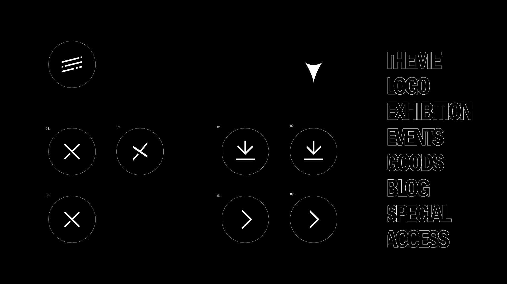

ついに公開された第 59 回菁々祭公式 Web サイト。そんな Web サイト制作を担当した PR パート技術セクション長と製作セクション長のお二人にお話を伺いました。

# 目次

## まずは Web サイトのデザインについて聞きました。

# Q.Web サイトのデザインというのはどのような流れで行われるのでしょうか。

製セク長「まずは 2 人で相談しながらどういうコンテンツが必要かとか、タイトルとかをまとめました。今年は実際に AdobeXD を使って技術的に可能なのかも話し合いながらデザインを進め、最後にコーディングって感じですね。」

技セク長「なかなか無茶言われましたけどね(笑)」

# Q.Web サイトのデザインはどこが特徴的だと思いますか。

製セク長「やっぱり色々なデバイスで見られる可能性があるので、スマホ、パソコン、タブレットといったどんなデバイスでもデザインの統一性が失われないように心がけています。特にブログの記事の文字なんかはスマホと PC とでは一行に表示できる文字数が大きく違ってて、その中で”読みやすさ”につなげるためにどうしようかなと試行錯誤を繰り返しました。」

製セク長「あと、コーダーの人と仲良くするってのも結構むずかしかったですね。」

# Q.Web サイトのデザインをする上で参考にしたものはありますか。

製セク長「とにかくたくさんのサイトを見ることはすごいしましたね。最近のトレンドを考えながら、その中で今回のテーマに必要なデザインやスタイルを採用していくみたいなのは考えてます。」

技セク長「[SANKOU!](https://sankoudesign.com/)っていう名前のサイトがあって、デザイン的に優れてるサイトを集めたサイトになっていて、そこのページを二人で見て　『このページがいい。』　『このページのココがいい』　みたいな感じで、まあある種パクリながらやっていた感じのところもあるので。」

技セク長「あと、例えば紙面だけでしか表現できないものとか、動画上でしか表現できないものとかもあるんですよ。Web サイト上にあるデザインだけを参考にすることによって、そういうのを排除できるんですね。Web サイト上で表現に既にされているものしか使えないので。そういう意味でも、やっぱり Web サイト自体を参考にするのは結構存在として大きかったと思います。」

# Q.難しかったことは？

製セク長「技術のコーダー側とデザインを実際にどういう形で実現していくのかをすり合わせる作業ってのは、やっぱなかなか言葉では伝わらなかったりするところもあって...結構手間かかったというか、難しい作業ではありましたね。」

製セク長「結構細かいボタンみたいなのが多くて、例えば 『1 ページ戻る』であったり、バツ印であったり。その中でも統一感みたいなのが必要かな？ っていう中で検討しながら進めました。マークとしての調和も必要だし、ウェブサイトと合わせるみたいな作業もやっぱ必要で。そういうところも苦戦しました。

デザインでコーダーと揉めたハンバーガーのアイコン

続いて Web サイトのコーディングについて。

# Q.そもそもコーディングとは？

技セク長「コーディングって聞いても基本的にはどういう作業かわからないと思うんですよ。でもこれが結構重要で。普通、ソフトウェア上で作るデザインってウェブサイトにそのまま公開できないんです。 Web サイトに公開するために”ある種の最適化”が必要で、 HTML や CSS っていうマークアップ言語を使ってプログラミングみたいなことをしてやっていくんですよね。」

技セク長「もちろんソフト上でつくられたデザインをそのまま再現はできないので、　『表現をどういう風に書くか？』　『ここの図形の位置の設定はどのようになるか？ 』　などを考えながら進めていきます。」

製セク長「翻訳するってこと？」

技セク長「うん、まあ翻訳に近いかもしれない。ただ翻訳って言ったらなんか機械的じゃない？もうちょっと能動的にやってるから...まだ変換の方がマシか。」

製セク長「変換の方が機械的じゃない？ 翻訳の方が人間感じるけど。」

製セク長「あ、これが感覚のずれってやつか。」

技セク長「こういうのがあとあと響いてくる。」

# Q.コーディングは誰がしたんですか？

技セク長「トップページは私がしたんですけど、他のページは後輩の技術セクション員にやってもらいました。」

技セク長「今年は複数人で作業することになって、それぞれのデータの共有をどうするかっていうのが課題だったんですよ。というのも去年のセクション長は全部一人でコーディングしてたので複数人で共有する必要がなかったんですけど、今回からはその必要があったので。なので今年は GitHub というサービスを活用して複数人でデータを共有しました。そのおかげでプロジェクトメンバー間のやりとりはうまくいっていますね。」

# Q.コーディングに興味を持ったきっかけは？

技セク長「公式の Web サイトをつくる前に、パート員募集の特設サイトをデザインからコーディングまで一人でやったんですよ。それまで Web サイト制作は挫折経験もあって、難しいと思っていたんですけど、もう一回やってみたら結構楽しくて、そっからハマってコーディングにのめりこんでいきました。」

パート員募集用特設サイト『パートの選び方』

# Q.今回の Web サイトではアニメーションが採用されているかと思うんですが、技術的な面で何か変化はありましたか？

技セク長「よくご存知ですね(笑)。去年は Bootstrap とかのフレームワークを使用してコーディングをしていらっしゃったみたいなんです。ただ今年は基本的にはフレームワークをほとんど排除して、アニメーションの時だけ、javascript の jQuery っていうのを使ってます。jQuery を使うことによって、結構自由なアニメーション表現ができるんですね。あとは CSS の機能で、トランジションとかアニメーションとかそういった動きをつけるものも多用しています。そこが去年と技術的には変化したポイントですね。」

# Q.なぜスムーズな動作が？

製セク長「CM みたいやな。『どうしてこんなに！？』みたいな(笑)」

技セク長「このサイトはアニメーションを結構採用してるんですけど、動画埋め込みはしてなくて CSS のアニメーションとか jQuery とかの機能を使って実装しているからですね。」

技セク長「東大寺学園って結構山の奥にあるので、電波環境が悪いんですよ。それでも菁々祭の当日にトップページの快適性は確保したいので、フォントや画像はかなり削減に削減を重ねました。例えばフォントは[源ノ角ゴシック](https://ja.wikipedia.org/wiki/%E6%BA%90%E3%83%8E%E8%A7%92%E3%82%B4%E3%82%B7%E3%83%83%E3%82%AF)を使用する予定だったんですが、最終的には[Google Fonts の Noto Sans](https://ja.wikipedia.org/wiki/Noto)に変更しました。」

製セク長「トップページを軽くするっていう作業はデザイン的にもよく対立するところでした。デザインをよくしたいと思うと、より多くの画像を使いがちなんですけど、そういうところをいい感じにバランス取っていくというのが。」

# Q.特にこだわったポイントは？

製セク長「トップページにあるページ紹介のグラフィックですね。Illustrator でシェイプを作ってから svg で blender に取り込み。そこからモディファイアーをいじってデータ作成して、書き出して素材として使用したので、けっこう手間がかかってます。他には、SPECIAL のページにある製作セクション員の人たちが作ってくれた壁紙とかヘッダーとかアイコンとかは、もっとみんなでコンテンツとして盛り上げていくみたいな。」

技セク長「SPECIAL のページは本来ウェブサイトのコンテンツが少なかったからできた企画で、その中にロゴがダウンロードできるところがあるんですけど、これはロゴを素材として使う際に正式なものを使ってもらえるようにという意味でもやっています。」

製セク長「コーディング・デザインとは関係ないけど、ブログの記事は結構見てほしいなと思ってて、これまでの菁々祭では知り得なかった裏の情報とか、『こんな経緯があって〜』とか。菁々祭の裏側を覗けるっていう点ですごい魅力的なコンテンツに仕上がってるかなと思うんで、ぜひ見ていって欲しいな。」

技セク長「他のページもね。」

技セク長「あと、トップページの 1 画面目って結構重要だと思うんですよ。そこでなにを伝えたいかっていうのを話した結果、テキストの横スクロールのアニメーションを作りたいという話になって。Adobe AfterEffects で試作品とかを作ってやりましたね。」

トップページのアニメーションは一度動画として試作された

「ここから専門的な話になるんで。まあ読み飛ばしてもらっていいんですけど、実は CSS の標準の機能だけでコーディングしたんです。CSS の animation を使用すると、 transform の translateX()だけでは横スクロールができないんですよ。右までは行くんですけど、そこから切り返しができなくて、+α でオブジェクト自体の絶対位置(position: absolute)で left を指定して left とアニメーションの transform の translateX 、この 2 つの値をアニメーション的に変化させることによって実現しています。ここは結構難しかった。かなり悩んだ。」

「フッターのコーディングなんですけど、デザインではかなり細かい文字が使われていたんですけれど、ブラウザの機能として font-size では 7px より小さい文字が出ないんですよ。その場合に 7 ピクセルの文字が使いたいって話だったので...今回取った方法として 14px の文字に transform の scale(0.5)をかけて 7px にするっていう処理をしてて、これがかなりコーディング的に面倒くさいです。判定は元の大きさなんですけど、 表示される文字の大きさが半分になっている、とか結構苦戦しましたね。 アクセシビリティ的な問題はあると思うんですけどね（笑）」

製セク長「そこは俺の中で譲れないポイントだったんで。」

「デザインという面でもアクセシビリティは重要なので拡大しないと見えないような文字を作るのは個人的にはどうなのかな～と思いますが」

製セク長「読めなくていい文字に適用してるので〜...」

「アニメーション的に結構こだわった部分としてはハンバーガーメニューが出てくるアニメーションですかね。まあこんな感じでデザインとのすり合わせが多かった、半分喧嘩みたいに。お前とはいつも喧嘩をする。」

# Q.現在未公開のページもあるようですが、なにか構想はあるのですか？

「エキシビジョンとイベントについて、ちょっと色々結構考えてて。エキシビションは校内展示なので、「場所」っていう軸が必要だったりとか、イベントは「時間」という軸が必要だったりとか、そういう視点でわかりやすいような Web サイトを構築できたらいいかなっていうアイデアはありますね。」

製セク長「まあ校舎複雑やからな。」

「校舎が複雑っていうのもあります。」

製セク長「初見殺しやろマジで絶対無理。」

製作セクション長(奥)と技術セクション長(手前)

# あとがき

この Web サイトには制作陣のこだわりポイントがたくさんあるので、それも探しながらお楽しみください

菁々祭当日に向け、Web サイトもどんどん更新していきます！こうご期待！
