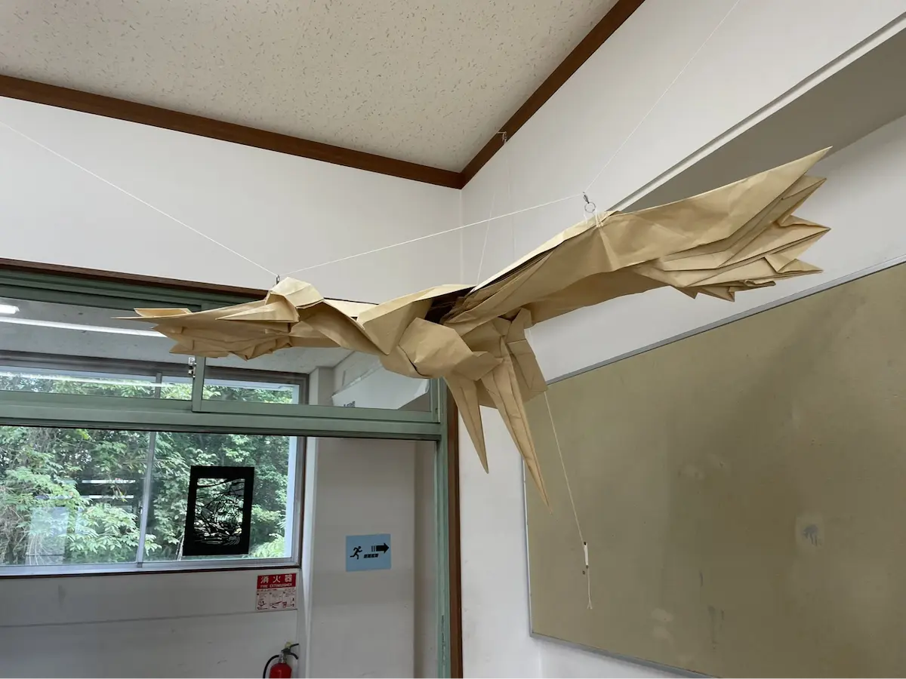

皆さんは東大寺の文化祭で最も印象的なものは何ですか？お化け屋敷だったり、転心殿前で行われる和太鼓だったりが思い浮かぶのではないでしょうか？今回はその中でも折り紙研究部の巨大作品に迫ります。そして巨大作品を展示している折り紙研究部の部長にお話を伺いました。

# 目次

# Q.巨大作品はどういうものなのですか？

他の個人作品より大きく、大人数で作る作品ですね。来場者の方によく訊かれるのですが、ホームセンターで売っているクラフト紙を 12 枚繋ぎ合わせた 3.6m 四方の紙で作品を作っています。 実は作るようになったのが数年前からなので歴史はまだ浅いのですが、菁々祭での折り研の目玉展示になっています。インパクトのある大きい作品っていうのはそれだけで集客力を持ちますからね。

# Q.普通の折り紙との違いは何ですか？

そりゃあもう、サイズですね(笑)。元になる紙がかなり大きいため、恐竜などの生物をダイナミックに表現するのに向いています。生物系は大きかったほうが映えますしね。 後はやはり紙が大きいと、それだけ作品となった時に自重がものすごく重くなるので、糸や針金、木材といった支えが必要になってきます。基本は体幹部を木材で、形を固定したい部位を針金で補強します。末端を糸で吊るすこともあります。とにかくスケールのでかい大掛かりな作業です。

別角度から。糸や針金が張り巡らされている。

# Q.製作過程で大変なこと、気をつけていることやこだわりなど教えてください。

はい。製作の前段階として、まずクラフト紙をテープで繋ぎ合わせなければ始まらないのですが、隙間をなくすために、、何人かで紙を固定しながら端と端とを慎重に繋ぎ合わせていく必要があるんです。。大事な部分ですから、気を抜けません。 また、折り目をきちんとズレなくつけるのも重要です。紙が大きい分、生じたズレも大きくなってしまいますので。

# Q.どれくらい時間がかかるのですか？

基本は自由参加なので、今年はどうなるかはまだ分かりませんが、去年の場合は、夏休み中に 5 人くらいの部員が 1 週間以上かけて作りました。

# Q.去年の後悔、そして今年の改善点は？

去年から部誌を発行し始めたので、その作成など初めての作業が増え、作品の完成が準備期間の週までもつれこんでしまいました。さらに、作品の展示にも時間がかかってしまい、一連の固定作業が終わったのは開催中になってしまいました。今年は日程に余裕をもって準備していきたいと思います。

# Q.折り研部員としての巨大作品への思いを教えてください。

そうですね、巨大作品を作る機会なんて人生でもそうそう無いかと思われます。サイズがサイズですから、趣味の範疇ではなかなか厳しい所があると思いますし(笑)。だからこそ、この経験を大事にしていきたいですね。

# Q.今年作る予定の巨大作品への感想

今年度から幹部が代替わりして、巨大作品を含めた菁々祭についてのノウハウを持つ前の代が引退し、自分たちが菁々祭への準備を仕切ることとなりました。先程も述べましたように、巨大作品の完成は折り研展示の成功にも関わってきます。展示の顔とも言える巨大作品作りの中心となることは少し不安ですが、精一杯頑張らせていただきたいと思います。

# Q.最後に来場者の方々へのメッセージを一言お願いします。

巨大作品は、このように裏にはたくさんの苦労があります。来場者の皆様、今年も期待してお待ちいただき、菁々祭当日はぜひ折り研展示へお越しください！

以上、インタビューでした！
