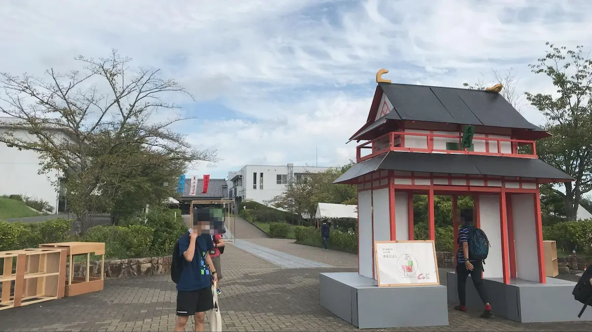

長年東大寺学園の一大イベントとして代々受け継がれてきた菁々祭。この記事ではぼくが小 5 の時に初めて遊びに行って衝撃を受けた第５４回菁々祭「fortissimo」を現在の菁々祭と比較しながら振り返っていきます。

# 目次

# 衝撃を受けた「fortissimo」

ぼくと菁々祭の出会いは自分が小学校５年生の頃の秋までさかのぼります。当時まだかけだしの中学受験生だったぼくは自分の志望校を模索中でした。そんな中、通っていた塾のすすめで遊びに行くことになったのが東大寺学園の第５４回菁々祭「fortissimo」でした。 当日、期待に胸を膨らませながら学園行きのバスを降りて校門を抜けると、待っていたのは、衝撃の連続でした。

# 衝撃１: 菁々祭を彩る校内の装飾

まずはじめに衝撃を受けたのが、校内のあちらこちらの装飾です。大きな壁画や窓の切り絵、渡り廊下のモザイクアート、そして「旧東京音楽学校奏楽堂」のオブジェ。一つ一つの装飾が作り手のクリエイティビティを反映していて精魂こめて作られているように感じました。極めつけはあの巨大な「フォルテッシ門」。来訪者を出迎える門は菁々祭の象徴といってもいいでしょう。文化祭が終わると取り壊されてしまう門の儚さが、二日間限りの輝きを一層際立たせているのが個人的に好きです。

画像は第５７回菁々祭「あおによし」の朱雀門。よくできていますよね。

# 衝撃２: 多種多様な部・同好会の展示

校舎に入ると、中は部や同好会の展示をめぐる多くの来訪者でにぎわっていました。 ぼくも、科学部に展示されていた沢山のホルマリン漬けにした昆虫の標本や、電子工作部の生徒たちの自作ロボットなど各団体の個性的な展示を見ました。また、囲碁将棋部での部員との対局や数学研究部の計算大会など、体験型の展示を行っている団体も多くありました。ぼくは当時クイズ研究部の早押し体験に参戦しましたが、みんな早すぎて数問しか回答できなかったのをおぼえていますよ...

ただ、ぼくにとって最も衝撃的だったのは、アニメ研究会、ドラえもん同好会、ポケモン同好会があることでした。アニメやドラえもん、ポケモンの団体を作ろう！といって簡単に承認してくれる学校はあまり多くないでしょう。ちょうどポケモンにはまっていた時期だったので、ポケモン同好会のクイズで高得点を取ってとても嬉しかったのを覚えています。（当時の人にしかわからないと思うけどマーシャドーの Z 技「七星奪魂腿」をこたえる問題に正解出来たのが特にうれしかったですね）

# 衝撃３: 熱気に包まれたイベント

菁々祭を語るうえで絶対に欠かせないのが、生徒たちが情熱をささげる数多くのイベントです。例えば、カラオケコンテスト、マッチョコンテストにイケメンコンテスト。ラップバトルや漫才の面白さを競う T-1 グランプリもあります。もう聞いているだけで面白そうでワクワクしますよね。近年は多くのイベントがグラウンドで行われるのですが、「fortissimo」の時は中庭でイベントが開催されていて、多くの観客が集まった中庭はすごい熱気で包まれていました。当時ぼくが見たのは全４団体によるダンスです。TDJ48 や卍ザイル、寺マスにラブライブ！サンスクリット！！それぞれ聞きなじみのある曲に合わせてかっこいい/かわいい踊りを披露しました。観客と OB 軍団の手拍子とコールによって生まれる会場の一体感は見ものです。もう一つ見たのが Mr.美少女コンテスト。ミスコンは菁々祭の華ですからね。女装してる男子高校生なんて最高じゃないですか！！！小学校五年生だったぼくにはちょっと刺激が強すぎたかもしれないですが、この少しはちゃめちゃな感じが菁々祭のイベントの良さだなあと思います。

当時のパンフレットのイベント一覧。どれもなかなかおもしろそうですよね。

様々な展示やイベントをまわって満足した頃には空があかね色になっていて、ぼくは帰りのバスに乗り込みました。バスの中でぼくはかすかに自分の中に憧れの感情が芽生えるのを感じていました。「いつかぼくもこの祭りを盛り上げてみたいな」と。

# 憧れのその先に

菁々祭を盛り上げたいと憧れた「fortissimo」からもう５年が経とうとしていて、同時にパンデミックの終わりも近づいてきて、今年はもっと多くの人が菁々祭を訪れることになるのではないかと期待しています。あの頃の熱気を再び取り戻し、当時の自分のように菁々祭の楽しさに魅了される人が増える 「RESONANCE」になってほしいです！
