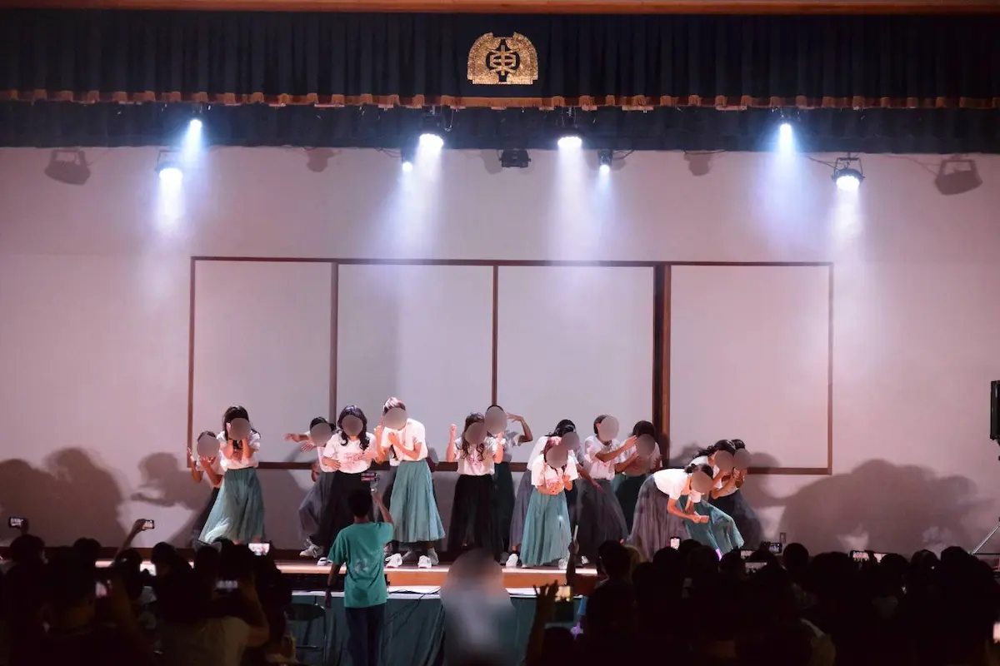

毎年盛大に行われる菁々祭。菁々祭の運営は、多くの生徒たちによって支えられており、その業務はパートによって分担されて行われます。ここでは、パートやその下部組織であるセクションについて、紹介していきます。

# 目次

# そもそもパートって何？

前述したように、菁々祭の運営業務を分担するための仕組みです。全体で6つのパートがあり、その中でもさらに細かい分担としてセクションが組織されているものもあります。

# PRパート

PRパートは、より多くの人が菁々祭に来てもらえるように、そして、来場者の方々に菁々祭をより楽しんでもらえるようにする業務を行うパートです。このWebサイトの作成もPRパートの業務にあたります。

## ・運営セクション

運営セクションは、菁々祭当日に教室や廊下にある案内看板の設置や、放送で案内を行う転心殿前インフォメーションの運営など、来場者の方々を案内する業務を行うセクションです。

## ・広報セクション

グッズなどの販売を行うセクションです。菁々祭当日の来場者の皆さんの接客を担当しています。

## ・製作セクション

毎年大盛況のグッズ、菁々祭の情報がわかりやすくまとめられたパンフレット、意匠の凝らされたロゴ……。それらをすべてデザインしているのが、この製作セクションです。また、カウントダウン画像やSNS上に投稿する動画の製作もこのセクションが担当しています。カウントダウン画像は[菁々祭公式ツイッター](https://x.com/seiseisai_tdj)から、ロゴ発表映像は[こちら](https://youtu.be/7v9g0vJNalM)からご覧になれます！

## ・技術セクション

今皆さんがご覧になっているこのWebサイトを製作しているセクションです。業務の難しさは一二を争うレベルのセクションです。Webサイト制作の過程をまとめた記事もありますので、ぜひご覧ください！

[2023.06.05
Webサイトができるまで...【技術＆製作セクション長インタビュー】
PRパート長](/blog/59/05)

# 校舎統括パート

物品の貸し出し、部誌の印刷、机やいすなどの備品移動、展示教室の割り振りなどといった重要な業務を行う、菁々祭の準備に欠かせないパートです。まさに菁々祭を支える縁の下の力持ちといったところでしょうか。

# 会計パート

ミスが許されない大仕事である予算の管理を引き受けているのがこの会計パートです。業務が最も繊細なパートといっても過言ではありません。

# バザーパート

菁々祭期間中、運動場などで屋台が立っているのを目にする方も多いと思います。その屋台を支えるのが、このバザーパートです。

## ・金券セクション

主に金券の販売を行うセクションです。金券の単位の読み方をご存じでしょうか？実は「シビ」と読むんです！東大寺学園の校章にも用いられている「鴟尾」をモチーフとしているようですよ。

## ・販売セクション

店舗での物品販売を行うセクションです。

## ・食品管理セクション

店舗で扱う食品や物品の管理を行います。裏方ですが、大事な仕事です。

## ・美化セクション

校舎の清掃を行い、校内の美しさを保っているセクションです。美化セクションは、校舎の清掃や装飾を担当しています。菁々祭の魅力を引き立てる役割を果たしています。

# イベントパート

菁々祭で行われる様々なイベントの企画・運営を行うパートです。

## ・ステージセクション

舞台イベントの管轄として、音響や照明の管理を行い、一体感のある演出を作り出しているセクションです。

## ・映像セクション

小講堂で放映されるオリジナル映画の制作を行っているセクションです。セリフ、脚本、演出をすべて生徒たちが担当しています。工夫の凝らされた映画を見ることができますよ！

## ・お化け屋敷セクション

お化け屋敷を運営しているセクションです。お化け屋敷セクションの特集記事もありますよ！

[2023.06.05
お化け屋敷の正体を直撃インタビュー！
PRパート員 M.K.](/blog/59/04)

## ・パフォーマンスセクション

文化祭の中でもかなり有名な、ダンスパフォーマンスを行うセクションです。TDJ48、E卍ILE(寺ザイル)など、それぞれ違ったパフォーマンスを見ることができますよ！アクロバティックな演出に期待しましょう！

去年の様子

# 装飾パート

絵の貼られた階段、ステンドグラスのような美しい窓、巧みに設計された門……たった２日間だけ命を吹き込まれるアートたち。それらを作り上げているのが、この装飾パートです。

## ・階段絵セクション

校内各所の階段に絵を貼り、階段を生まれ変わらせるセクションです。

## ・門セクション

今年こそはと意気込んでいるセクションです。校門を入ったところにある入場門は、彼らの何ヶ月間もの尽力の賜物です。

去年の作品（去年は開催日に間に合わなかったそうだ）

## ・ロゴモニュメントセクション

校舎前に文化祭ロゴのモニュメントを制作するセクションです。

こんな感じのモニュメントが作られます！

(モニュメント製作についての詳しい記事はこちら↓)

[2023.06.26
【ギャラリー】ロゴモニュメント「四季彩」の記録
PRパート副パート長](/blog/59/09)

# まとめ

いかがでしたでしょうか。菁々祭には様々な人達が携わっていることを知って、菁々祭をさらに楽しむきっかけになれば幸いです。以上、パート・セクションの紹介でした。
