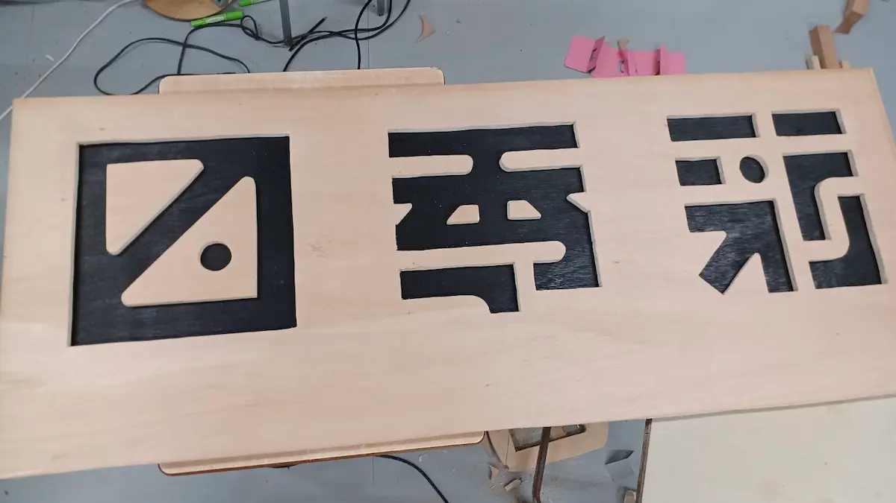

「門」と共に菁々祭を飾るために佇むロゴモニュメント。前回の「四季彩」のロゴモニュメントの製作にちょっぴりかかわった身として、その製作過程の一部をここに残しておきます。

# 目次

# ロゴモニュメントの歴史

文化祭ではテーマに合わせたロゴがデザインされますが、そのロゴを木材を使って3次元に造形したモニュメントが前々回の「あをによし」と前回の「四季彩」の2年にわたって作られ、今回の「RESONANCE」でも製作されます。前回までの2年は校舎統括パートが作っていたロゴモニュメントも、今年から装飾パートにロゴモニュメントセクションが新設され、そちらの業務となりました。

# 製作の概要

## １.設計

先輩方が一生懸命やってらしたのを覚えています。

## ２.箱

まずロゴの土台となる箱を作りました。直方体に組んだ骨にベニヤ板を貼り付けただけの簡単なものですが、外側から白いペンキを塗る作業が大変でした。

## ３.文字

スプレーで黒く塗ったベニヤ板に、ジグソーで文字をくり抜いた板を重ねました。くり抜いた方の板はこの後白く塗られます。

## ４.ロゴマーク

先輩方が、切り出したベニヤの置き場所と重ね方を話し合っています。

確定したようです。

色が塗られました。この時点で、菁々祭開始まであと2日でした。

## ５.完成

組み立てが完了し、無事完成しました。

菁々祭前日。菁々祭が始まるのが楽しみと言わんばかりの佇まいです。

## ６.裏面

モニュメントの裏面に何を描くかという問題がありました。いくつもの案を出し合い、話し合った末、バンクシーの絵画を模したスプレーアートをしようということになり、その方向で進んでいたのですが、なにしろ時間がありませんでした。仕方なく従来の案は諦め、代わりに菁々祭のWebサイトのQRコードをペンキで描くという結論に帰着しました。

ロゴモニュメントの裏面。作業は当日の朝7時半から始められ、開場時間までかかりました。

# 当日

来場者の方々に感謝です。

菁々祭2日目の夕方。祭は刹那に過ぎてゆきます。

# おわりに

菁々祭当日、多くの人に写真を撮られながらただそこに立っていたロゴモニュメント。製作にかかわった人全員の心に残っていることでしょう。第59回菁々祭「RESONANCE」への期待が高まります。
