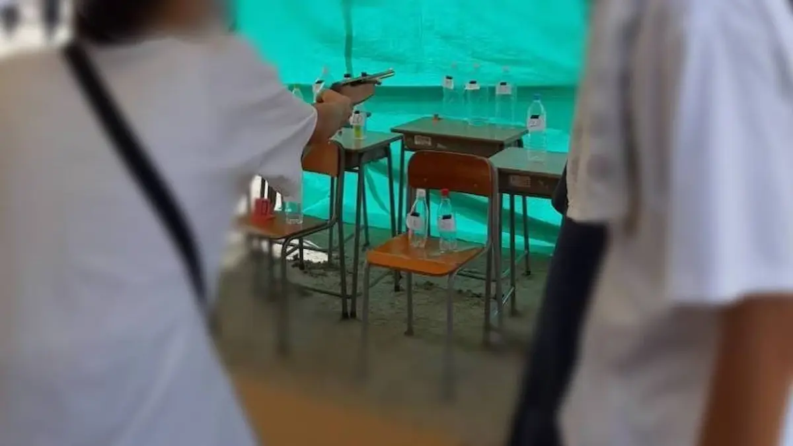

毎年大勢の方々に来ていただいている菁々祭。整理券の配布が終わっていて、行きたかったイベントに行けなかったなんてことも。まずは、特に菁々祭が初めての方々に向けて、イベントの整理券に関する情報をお伝えします。さらに、3年連続で射的の1等を獲得している会計長に、射的のコツについて直撃インタビューしました！役立つ情報満載ですので、射的が初めての方も経験者の方も必見です！

# 目次

# 菁々祭の整理券を攻略！

菁々祭では、体育館、中庭、運動場、圓融館など様々な場所でたくさんのイベントが行われています。中には要整理券のイベントもあります。例えば、お化け屋敷などですね。 お化け屋敷は菁々祭の一大イベントで、毎年非常に人気です。そのため、整理券の争奪戦も激しいです。去年は私もお化け屋敷の製作に関わりましたが、1組1組にじっくり楽しんで（怖がって？）もらえるような工夫が盛り込まれていました。

(お化け屋敷のインタビュー記事はこちら↓)

[お化け屋敷の正体を直撃インタビュー！](/blog/59/04)

整理券の配布は転心殿前で行われます。一部のイベントでは、整理券が一度のみ配布される場合もありますが、お化け屋敷のように複数回にわたって配布されるイベントもあります。人気のあるお化け屋敷などでは、一回あたりの配布数がかなり少ないので、時間通りに行ってもすでに配り終わっている可能性があります。また、配布が一度きりのイベントでは、整理券を取り忘れないように注意しましょう！

ですので、行きたいイベントの整理券を手に入れるためには、少し早めに行くことをおすすめします。整理券の配布時間は転心殿前インフォメーションからの放送で適宜告知されるので、ぜひチェックしてください！

# 射的の裏側に密着！！

ということで、射的の会計長にお話を伺っていきます。よろしくお願いします！

 　よろしくお願いします。

# Q.射的で三年連続1等を取ったと聞きましたが、本当ですか？

 　本当です。最初は景品を貰えたのですが、そのうち出禁になってしまいました。今は自称ゲームマスター(笑)をやっています。レベル調整の権限は7割くらい僕にあります。近年は運営側の成長も著しく、1等を取っている運営も僕の他に何人かいます。

# Q.射的のコツとかあったら教えて下さい。

　まずはできるだけ的に近づく事ですね。体を最大限に乗り出して、腕を思いっきり伸ばします。この時、両足が地面から浮くとルール違反なのでご注意ください。狙う場所はペットボトルの上の方の、幅が狭くなり始める部分ですね。

　また、初めての方は20点ボトルを狙うのがおすすめです。10点、20点ボトルは倒れないことがない(当社調べ)ので、玉は4発あるので、これで80点までは頑張れば取れると思います。慣れてきたら40点ボトルまでは比較的簡単に倒せると思います。

的までの距離のイメージ。もう少し体を乗り出し...てもいい？!

# Q.一等を取るコツみたいなものはあるのでしょうか？

　1等を狙うならまず60点ボトルを狙いましょう。1等に必要な点数は恐らく180点なので(初めのほうは240点ぐらいの時もありますが、その場合は頑張って下さい)、60点ボトルを3回当てたらいい計算です。玉は4発渡されるので、3/4ですね。やはり初見では難しいようで、近年1日目で1等を当ててる人は滅多に見ません。確か僕が初めて1等をとった時は8回目くらいだったので、そのくらいの回数をこなす覚悟は必要だと思います。

　次に時間帯ですが、圧倒的に2日目の午後がおすすめです。なぜかと言いますと、この辺りで大幅な点数調整が入る事が多いからです。去年は1等が180点→150点くらいまで下がってたと思います。下がり幅はその時に残ってる1等商品の数によって変わります。ちなみに1日目で1等が全て取られた場合には運営(会計担当の僕)による(自腹の)補充が入りますのでご安心下さい。僕の財布をカラッカラにしたいという猛者は1日目に1等をむしり取って下さい。

去年の一日目午前の時点の様子。景品はお楽しみに！

# Q.文化祭を楽しむポイントとかありますか？

　日傘ですね。これは必須中の必須です。本当に暑いです。空調服なる涼しい服を着て作業をしている人もいます。

　あと、これは射的ブース限定ですが、景品のリクエスト等あれば受け付けます。1日目に言ってくれれば2日目に反映されるかもしれません。去年は大量に売れ残ったアニメのクリアファイルを運営が総取りしてました。このような事態にならない為にも、皆様の意見をお借りしたいんです。

　リクエストをする際は暇そうな運営(玉拾い係)に声を掛けてください。リクエスト以外にもいろんな質問やお話にもこたえられると思います。

以上、インタビューでした！ありがとうございました。

# おわりに

僕も奇跡的に射的で1等を取ったことがあるのですが、いわゆる運営側の人間で出禁対象だったので、景品はもらえませんでした(泣)。皆さんはぜひ1等を狙いにいって下さい！射的以外にも今年も様々な屋台が出ると思います。校内を巡ったり、イベントに参加したり、屋台で遊んだりして、文化祭を満喫して下さい！
