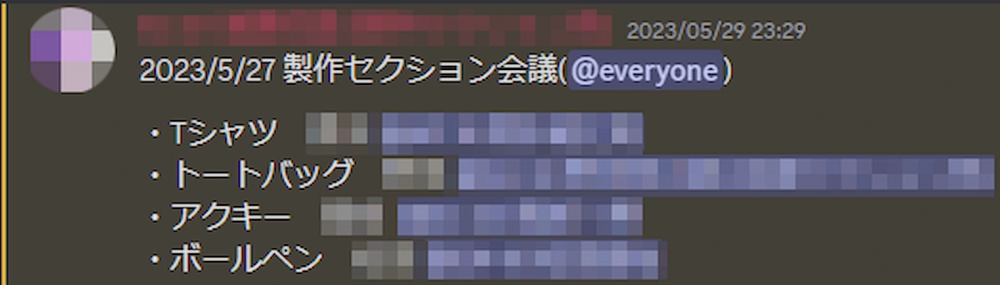

｢デザイン｣そのものについてや､デザイン用ソフトの使い方に関する知識がほぼ無かった僕が､先輩の助けを大いに借りながら､菁々祭のグッズの1つであるアクリルキーホルダーをデザインした過程を紹介します｡

# 目次

# なぜ僕がグッズデザインをすることになったのか

グッズの制作は､PRパート製作セクションが行っており､5月末にDiscord上でデザイン担当者を決める会議が行われました｡残念ながら､僕はその日､用事があって会議に参加できませんでした｡

数日後､家に帰ってDiscordを開いてみると､なんと僕がアクリルキーホルダー(以下 アクキー)のデザイン担当に決定していました!?僕の知らぬ間に......

↑家に帰って見たメッセージ｡｢アクキー｣の隣に､僕の名前が......

これ以前のデザインたるデザインの経験は､ [菁々祭ホームページのSPECIALページ](https://web.archive.org/web/20231202192505/https://seiseisai.com/2023/special/special.html)上のデザインのうちの1つだけでした｡その時はIllustrator(デザイン用のソフト)の基本操作を覚えるだけで精一杯だった僕に､どうやってグッズデザインをしろと???(泣)

# とりあえず何かを作らないと

去年のアクキーのデザインを見て､とりあえずこういう感じに作ってみよう､ということにしました｡

↑去年のアクキーのデザイン｡めちゃ好き｡

とりあえず最初は､去年のデザインを参考に､中央にロゴを置いて､その周りに文字を置く､という方針で作り始めました｡ 今年のRESONANCEロゴは､流動的で特徴的な形なので､その形を活かしたデザインをしてみることにしました｡

↑最初に作ったデザイン｡外側に行くにつれて､円形に近づくようにしている｡

アクキーの大きさを､今回は5cm×5cmに収める必要があるので､文字が小さすぎると読めなくなってしまいます｡そのあたりも気をつけながらデザインする必要があります｡

↑デザイン第2案｡さっきのよりはベターな気がする？

また､文字を外側に配置しないバージョンも作りました｡
けど､何か落ち着かない感じがしました｡どうしようもないまま､締め切りが迫ってくる......

# 助けて～

人生､行き詰まったときは､一人で抱えてはいけませんよね(？)｡ということで､先輩に助けを求めることにしました｡

↑助けを求めた図｡困ったときは､人に相談するのが大事です｡

そして､優しい優しい先輩がその夜に通話してくださることになりました｡そこで､根本的に形を変えてみたらどうか､ということになり､今のデザインの原型が出来ました｡

↑今のデザインの原型｡もとのデザインから大幅に変更｡

ロゴの特徴的な形を､あえて長方形と組み合わせることで､斬新な形が出来るのではないか､という発想です。

でも､この状態だと､端の白い枠と被っているところの文字が読めなくなっています｡僕は､これまた解決策が見当つかなかったので先輩に解決策を聞いてみたところ､文字の周りをくりぬいたらどうか､というアドバイスをいただきました｡

その後も何かと修正を重ねて､今の最終的なデザインになりました｡

↑最終形｡結構満足しています｡

そして､業者に渡す用のデータを作成して､僕の仕事はおしまいです｡

カットライン

デザイン

白版

※白版とは？

→デザインが透けてしまうのを防ぐ､白インクの層のことです｡アクキーの裏面を見たら､何のことか分かると思います｡

↑アクキーの裏側の写真｡これが白版です｡

あとは､先輩が業者にデータを送り､発注したら､アクキー完成です｡

# おわりに

こうして､初心者の僕は､無事(？)アクキーデザインを完了しました｡自分のデザインしたグッズが多くの人たちの手に渡る､と考えると､なんだか不思議な気分です｡

ところで､僕はアクキーをデザインしましたが､他にもたくさんのグッズがあります｡[現在､旧Twitterで発表されているもの](https://x.com/seiseisai_tdj/status/1671822217192296448)だけで､Tシャツ･トートバック･ボールペンがあり､これからさらにいくつか追加されます｡ぜひ文化祭当日にでも買っていって下さい！！！

僕が以前書いた記事はこちら↓ ぜひ一緒にどうぞ！

[【迷ってる人必見】菁々祭どこ巡る？体験型展示のすゝめ](/blog/59/02)
