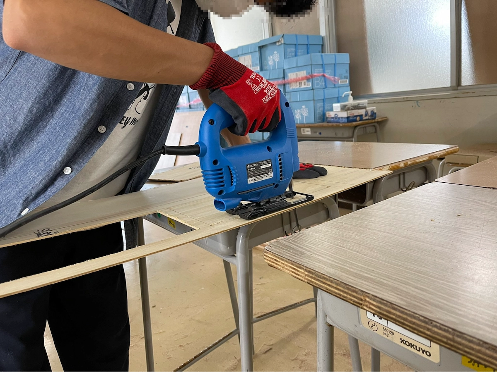

文化祭当日、東大寺学園を訪れた時、鮮やかに作られた門が最初に目に入る人も多いのではないでしょうか？今回はそんな菁々祭の一大シンボルともいえる門を作る門セクションのトップに話を伺いました。

# 目次

# Q.「なぜ門セクションに入られたのでしょうか？」

僕が門セクションに入ったのは、去年の春のことです。第 57 回文化祭の“朱雀門”を見て、誰の目にも留まる大きな門を作ることに憧れたのがきっかけです。去年、今年と、門を作る作業は苦労も多いですが本当に楽しく、入って良かったと思っています。

# Q.「門はどのような工程を経て作られるのでしょうか？」

## 1.題材決め

日本・世界の名建築と言われるような建物をリストアップし、投票やコメントをして絞り込んでいきました。（昨年度）

## 2.設計

自分たちで、1 から門を設計していきます。全工程の中で 1 番と言ってもいいくらい、大変な作業です。

## 3.模型作り

設計図をもとに、小さな木材を使って 10 分の 1 ほどの模型を作ります。予想以上に楽しいものです。

## 4.木材の切り出し＆やすりがけ

木材の切り出しを、ノコギリやジグソー（写真）を使って行います。特にノコギリ作業は体力がいるので、毎年過酷です。切り出し後は一個一個丁寧にやすりがけをします。

## 5.ペンキ塗り

意外と難しいのがこのペンキ塗りです。ムラが出ないように塗るためには、一瞬たりとも気が抜けません。少し時間が経つと色が変わってしまうのも悩みの一つです。

## 6.パーツごとに組み立て

円形広場で組み立てる前に、まず室内でパーツごとに組み立てます。この頃から徐々に門の形が表れて行き、テンションも上がります。

## 7.円形広場での組み立て

パーツごとに組み立てが終われば、いよいよ円形広場での組み立てとなります。門セク員総出で最後の仕上げです。2m の足場に乗って作業するのは、想像以上の怖さで、慣れることはありません…

## 8.当日

去年は、何とか菁々祭開催中に完成させることが出来ました。もちろん、今年は開催前までの完成を目指して頑張っています！

## 9.解体

菁々祭が終わると、門はすぐに解体されてしまいます。何ヶ月もかけて作った門を、一瞬で壊してしまうのは、虚しく、儚いものです。

# Q.「今年の門は一体どうなるのでしょうか？」

今回の門の題材は何なのかと度々聞かれますが、今年は題材にしたものはありません。完全オリジナルの門となります！ これは、第 55 回菁々祭のヨット”菁々丸”以来のことです。

また、今年はきちんと文化祭当日までに門が完成するのか心配な方も多いと思います。開催前の完成に向けて、今年は 2 つの工夫をしました。

1 つ目は、木材リストの配布です。切り出しする木材やペンキを塗る木材のリストをセクション員に配布し、次の作業が誰でも分かるようにしました。

そして 2 つ目に設計の簡略化を行いました。これまでは膨大な時間をかけて手書きで設計をしていましたが、今年は 3DCG ソフト(blender)を用いて設計し簡略化しました。

# Q.「後輩に向けて一言お願いします」

この記事を読んで、もしくは僕と同じく門に触発されて、門を作ってみたいと思った人、次は君たちの番です！ぜひ来年は門セクションに入ってください！

# おわりに

今年の門にも乞うご期待！

また、菁々祭には門以外にも様々な見どころがあります。楽しんでいってください！
