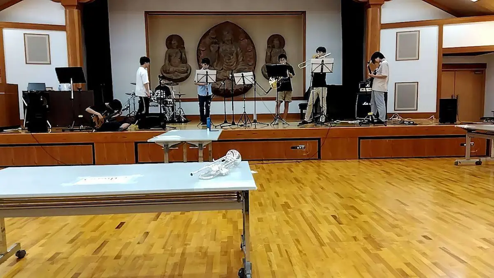

今年は音楽部と室内楽部の合同バンドがライブをするようです。あまり接点がないように思える 2 つのクラブが集まるこの企画は、一体どのようなものなのでしょうか？企画者である音楽部員のドラム担当の O さんとバンドのメンバーである室内楽部員のトランペット担当の K さんにお話を伺いました。

# 目次

# Q.なぜ室内楽部とコラボしようと思ったのですか？

O さん：室内楽部さんの演奏には音楽部にはない上品さがあります。クラシックを演奏するという点でもそうですが、指揮者が示すテンポに従順といいますか…。一方で、音楽部の演奏には指揮者がいません。本番で緊張してしまい、思わずテンポが速くなったり、間違えた時にメンバーが笑ったりするなど、その場のノリというものがあるんですよね（笑）。このように対照的な室内楽部と音楽部を組み合わせるとどういう化学反応が起こるのか興味があったんです。

# Q.それぞれのクラブから参加するメンバーを教えてください。

O さん：音楽部からは、エレキギターとボーカルが 1 人、エレキベース、ドラムが各 2 人参加します。

K さん：トランペット、ホルン、トロンボーン、クラリネットがそれぞれ 1 人、室内楽部では弦楽器を弾いている部長がキーボードで参加します。

合同練習の写真

# Q.演奏する曲はどのように決めましたか？

O さん：最初に、僕たちで候補曲をどんどん挙げていきました。そして、LINE のグループ通話で話し合いをして 3 曲に絞りました。ちなみに、今回演奏する曲は聞く人が飽きないようにバランスよく選んだつもりですので乞うご期待を！

K さん：グループ通話は 3 時間弱かかりました。最後の 2 曲から 1 曲選ぶところにかなり時間を要しましたが、いい選曲ができたと思っています。曲は J-Pop とファンク、ジャズっぽいのが 1 曲ずつです。

## Q.一緒に練習をしていて気づいた難しさなどはありますか？

K さん：ドラムの音が思っていたよりもかなり大きかったです（笑）。また、一部のクラシック曲でもそうなのですが、曲中の休みが長い割にフレーズは難しかったりして結構しんどいです。あと、管楽器の編曲は僕がしたのですが、トランペットが一番高くて目立つ音を演奏することが多く、失敗できないというプレッシャーがあります。

O さん：今の話とも被るのですが、管楽器の音が埋もれちゃうことですかね。本番では音量調節用の機材を使うので問題はありませんが、練習となると、聞きたい音が聞こえず、思い通りいかないこともあったりします。練習のためだけにそういう機材をわざわざ取り出すわけにもいかないので、少々困ります。

## Q.もし相手のクラブに入部するとしたら、したい楽器などはありますか？

O さん：僕はコントラバスに魅力を感じます。オーケストラのいわゆる低音を奏でる楽器です。コントラバスはエレキベースでは鳴らすことのできない弦楽器特有の滑らかな低音を出すことができます。それがオーケストラの上品さを支えているのかなと思ったりもします。

コントラバスを持つ人の写真

K さん：O さんはコントラバスと言いましたが、僕は逆にエレキベースがしたいです。エレキベースはコントラバスよりも軽いですし様々な奏法があるのがいいですよね。うねるようなベースラインを演奏してみたいです。

エレキベースを持つ人の写真

## Q.最後に、演奏を見に来てくれるみなさんに向けて、意気込みをお願いします。

K さん：僕もいわゆるバンドの中で演奏したいとは前から思っていたので、音楽部の方からこの話をもらった時には嬉しかったです。菁々祭に来る方に、グループで演奏する楽しさを感じてもらえたら幸いです。

O さん：このような部活と部活のコラボは自分にとって新たな挑戦です。素敵な演奏をみなさんに届けられたらいいなと思ってます。

ありがとうございました。
