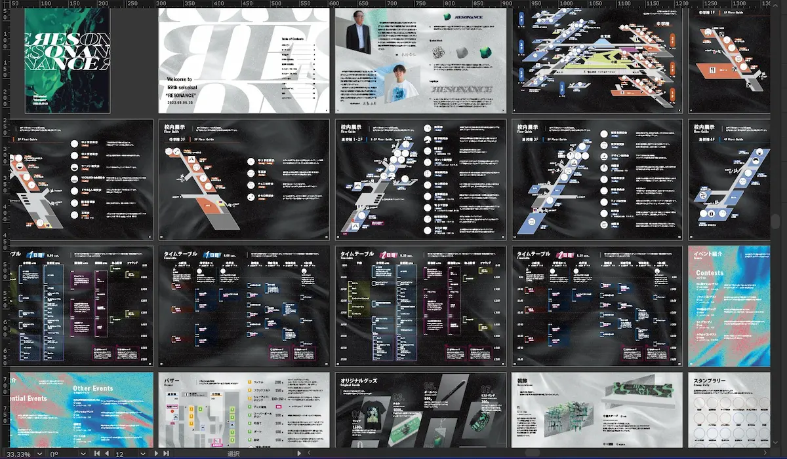

より便利に菁々祭を楽しむために欠かせないパンフレット。展示やイベントなど幅広く菁々祭の情報を網羅するパンフレットはどのようにしてうまれるのでしょうか。パンフレットを「作る」という視点から覗いてみませんか？未公開の裏話も続々…

# 目次

# はじめに

第58回と第59回の菁々祭パンフレットの編集長を務めさせていただきました。経験の乏しい高校生なりに努力したパンフレット制作の過程の一部をお見せしたいなと思います。この記事を読んだ後に、新しい視点からパンフレットを見ていただければ幸いです。

パンフレットの全ページ

また、この記事をご覧になっている方の中にDTP制作に詳しい方がいらっしゃいましたら、今後このような制作を手がける上でのアドバイスなどをいただけるととても助かります。こちらのメールアドレス(amukat0914@outlook.jp)に送っていただければ来年度の担当者に申し送り事項として伝えさせていただきます。そのほか、パンフレットに関する質問などもこちらのメールアドレスに送付いただければ可能な限りでお答えいたします。

# スケジュール

今年のパンフレットはこんな感じのスケジュールで作っていました。

## 4月〜6月

印刷会社とのやりとり。予算見積もりや仕様決定。各団体から紹介文の回収。

## 7月

デザイン制作開始。

## 8月8日

仮原稿を印刷会社に提出。

## 8月10日

仮原稿からデータ作成上のミスが見つかりました。(TAC値制限超過や画像のリンク切れなど)

## 8月17日

印刷会社の方と打ち合わせ。データ作成の際の注意点やテクニックなどを教えていただきました。ここである程度修復しつつ、帰宅後全てのページに適用しました。

## 8月20日

印刷会社から簡易色校正が届きました。その日のうちにデザイン的に気になる部分は修正を入れて対応。校正大会準備も。

色校正の紙の束の写真

## 8月21日～23日

校正大会！！！ミスがいっぱい見つかり修正に追われていました。

校正大会の写真

## 8月24日

予備日として設けていましたが、パンフのミスがみつかるペースに嫌な予感がしたためここでも校正・校閲。探せば探すほどミスが見つかり、気が付けば25日の朝4時半でした。

## 8月25日

印刷会社にデータを提出。

## 8月28日

印刷会社からデータチェック用の仮刷り原稿を受け取り。表紙の画像の解像度に不安が生じたため、急遽データ差し替え。当日中に最終納品。(実はこの日、印刷工場を見学させていただきました。めっちゃデカいオフセット印刷機！裁断機！すごかった！)

印刷工場の写真

## 9月5日

到着！！！！！！！

到着したパンフレットの写真

# 印刷仕様

デザインの制作に取り掛かる前にいくつかのことを決定しなければなりませんでした。予算とにらめっこしながら、印刷会社の方と話し合いを進め、仕様を固めていきました。 今年度のパンフレットはA5サイズの中綴じ表紙込み40ページのフルカラーでのオフセット印刷で仕上げています。表紙にはシルバーダイヤDRY135kg、本文にはシルバーダイヤDRY110kgを使用しました。また、表紙にはクリアトナーによる加工も施しています。 A5サイズは第55回以降継続的に用いられてきていますが、文化祭中に片手で持って歩くことを想定した冊子においては最適ではないかと思っています。

# 冊子としての一貫性

パンフレットのデザインは冊子全体を通してのデザイン的な一貫性を保つ必要があります。そのため、以下のような制限を設けながら制作を進めました。

## 文字とフォント

小塚ゴシック Pro の書体見本。

和文フォントは小塚ゴシックProを採用しました。Adobe社の開発した和文OpenTypeフォントで、Illustratorではデフォルトの書体として登録されています。評価の割れる書体ですが、僕はとても好きです。

ITC FranklinGothic LT Proの書体見本。

欧文フォントは ITC FranklinGothic LT Pro を採用しています。小塚と同じく時代を感じる書体ではありますが、あえてモダンなテイストの画面に落とし込むことで異彩を放つデザインになったのではないかと思っています。

原則、本文は［フォントサイズ7pt/行送り12pt/メトリクス/トラッキング75em］を使用しています。ウェイトは背景の色によりRegularとMediumを併用しました。(この処理が冊子の設計として正しいかどうかがわかりませんでした。詳しい方がいれば教えてください。)

また、どうしても本文よりも小さいサイズでなければならない文字に関しては［フォントサイズ5.5pt/行送り9.4pt/メトリクス/トラッキング50em］を適用しました。

段落設定は全て［追い込み優先/約物半角］をかけています。 また、数字に関して日本語文中内に1桁であれば全角、2桁以上あるいは英文中内では半角にしています。・(中黒)に関しては全て半角で揃えています。

ページタイトルは［フォントサイズ24pt/メトリクス/トラッキング75em］をベースに組みつつも、場合によりカーニング処理をしています。

## マージン

Adobe Illustratorでのマージンの設定の様子

画面に情報を詰め込むため、マージンは少し狭く設定しました。ノド:12mm、天・地:10mm、小口:10mmに設定しました。地の余白はもう少し広くとっても良かったのかもしれません。

## 背景素材

今年のパンフレットは以下の3種類の画像で背景を作っています。また、3種類の素材は全てepsデータに変換することで軽くしています。

### 1.black.eps

black.eps

- カラープロファイル難しい...

正直、これが1番苦戦しました。もともとRGBで以前作った素材をベースにしていたので、CMYKに変換する必要がありました。その際、AdobeのデフォルトのCMYKプロファイルであるJapan Color 2001 Coatedを使う予定だったのですが、Japan Color 2001 CoatedのTAC値制限は350%。実は印刷会社さんからTAC値を300%以内にするように言われており、そのまま変換すると300%を超えてしまったのです。どうしよう。ネットの記事を漁り、PhotoshopでTAC値の制限を新規に設定したカスタムCMYKプロファイル作って変換させればいけることが分かりました。ありがとうインターネット！！

- ほんとに合ってるのかな...?

ただ、ここでもさらに問題が出てきてしまいました。IllustratorではPhotoshopのようにカスタムカラープロファイルを設定できないのです。結局調べまくっても答えは出ず、カスタムプロファイルに変換したデータをJapan Color 2001 Coatedに再変換してから貼り付けることで一応300%の基準は下回ることができました。けど、このやり方で合ってるのかな…? 謎は残るばかりです。

### 2.white.eps

white.eps

1で紹介したblack.epsをベースに白を基調とした背景素材も使っています。全体的に黒を基調に冊子を組みつつもところどころを白い背景に抑えることで単調さを軽減するのが目的です。この素材はTAC値が300%を超えることは絶対にないので安心して作業できました。

### 3.psychedelic.eps

phychedelic.eps

こちらも1で紹介した素材をベースにグラデーションマップをかけています。40ページの冊子ですから、そのうちの何ページかはインパクトのある画面にしたいと考えていたので、カラフルで主張の強い背景素材も作ってみました。他の2つとは対照的な背景素材になったと思います。

# 各ページのデザイン

## 表紙

パンフレットの写真

みなさんは気づきましたか？実は今年の表紙は表面の一部にクリアトナーがのっている豪華仕様です。おそらく菁々祭パンフレット史上初めての特殊印刷です。光に当てたときに、クリアトナーがのっている部分とのっていない部分とで質感の差が出てとても映えます。

Blenderで編集している様子

背景に使っている画像は、実は[ロゴ発表映像](https://youtu.be/7v9g0vJNalM?si=U4HHRz3efbSZGx-h)の没カットです。blenderを使って、今年のロゴの3Dデータをベースに流体演算をかけています。レンダリング時の解像度は驚異の5760×3240px。A5の冊子の表紙としては明らかにオーバーサイズですが、他の用途にも使えるかもと思って大きめに書き出しました。使わなかったんですけどね。

## P.2 ごあいさつ

「ごあいさつ」ページ

「ごあいさつ」の英語表記に悩みました。ここでの「ごあいさつ」は単なる挨拶ではなくそのメッセージに置かれていることから「Greeting Messages」や「Messages」などの案も出ましたが最終的には「Greetings」としました。正しいかどうかの確証は正直ありません。今年度のごあいさつページの写真は校長先生と実行委員長に分けて配置しました。菁々祭のパンフレットの中で今までにないレイアウトになったと思います。(一応例年通りのツーショットも撮影していたのですが、私の表情が固かったのもあってこちらのレイアウトを採用しました。)　実行委員長とパンフレット編集長を兼任している都合上、必然的に自分の写真を自分で紙面に配置することになるので、少し変な気分になりました。せっかくだったら加工マシマシに盛りまくっても良かったかなと思っています。

「ごあいさつ」ページの写真

本郷校長のサイン

今年はごあいさつの名前のところをそれぞれの手書きにしてみました。校長先生はペンで、実行委員長は鉛筆で書き、それぞれの「らしさ」を演出しています。 実はごあいさつのページデザインよりも実行委員長あいさつの方が苦戦していました…

## P.3 テーマ・ロゴ

今年のテーマやロゴの説明を加える場所ですね。以前からもあったのですが、1ページ丸々を使い始めたのは第58回からです。基本的にはロゴ発表時に使ったグラフィックを紙面用に再構成して作成しています。ここの図形がかわいくてお気に入りです。

ロゴデザインについての詳しい記事はこちら↓

[2023.06.05 ロゴデザインの裏側に密着？！PRパート員 S.Y.](/blog/59/01)

## P.4 - P.5 校内全図

校内全図ページ

基本的には第55回のベースを踏襲する形で制作しています。ベースはできあがっているので組むのは簡単なのですが、めちゃくちゃミスが起きやすいところだとも思っていたので慎重に作りました。この記事の執筆時にはすでに印刷会社に入稿済みなので、ミスがないかハラハラしています。とてもこわいです。 また、こちらの校内全図はさまざまなところで使うので、利便性のためにレイヤーの整理を細かく行なっています。

## P.6 - P.17 校内展示

校内展示ページ（中学棟1F）

校内展示ページ（中学棟2F）

校内展示ページ（中学棟3F）

校内展示ページ（高校棟1・2F）

校内展示ページ（高校棟3F）

校内展示ページ（高校棟4F）

こちらも第55回のベースを使って組んでいます。「◯年△組」の表記に少しこだわっています。数字と英字の情報が先に見えるようにサイズをひとまわり大きくして、ベースラインも調整しました。今年は6年F組にも展示が入るということで、紹介文を１ページに10団体も詰めることに。

## P.18 - P.25 タイムテーブル

タイムテーブル1日目ページ1

タイムテーブル1日目ページ2

タイムテーブル2日目ページ1

タイムテーブル2日目ページ2

今年のタイムテーブルは、雨天時含め14列×2日分の28列を8ページに収めました。普段と比べて情報量が多めになったと思います。今年は例年に比べイベント数が非常に多く、後述するイベント紹介のページに全ての紹介文が入りきりませんでした。そのため、タイムテーブル上に紹介文を記載できるイベントについてはこちらのみに記載することで対応しています。できるだけタイムテーブルに紹介文を記載するイベントを増やすため、校舎内のイベントは15:00までに終了することを利用し、それぞれの日程の3・4ページの時間軸を下にずらし、上にスペースをとって紹介文を記載する方法をとりました。イベント開催場所の色はそれぞれのサインシステムに対応しています。 また、イベントの期間を表す長方形はレイヤー設定を使い、背景のテクスチャを活かした表現にしています。

## P.26-P.29 イベント紹介

イベント紹介ページ1

イベント紹介ページ2

バチバチの高彩度背景素材で画面に絶対的なインパクトを出しています。紙面の都合上、ここではタイムテーブルに紹介文を掲載できなかったイベントの紹介文のみを掲載しています。そのため「イベント一覧」ではなく「イベント紹介」としました。

## P.30-P.31 バザー

バザーページ

今年度は4年ぶりの食品解禁ということで、ワクワクしながら作っていました。P.31にどうやって情報を詰め込むかが肝でしたね。もう一店舗あったら危なかった...。 金券で使われている通貨単位である「シビ」はオリジナルのため、フォントが存在しません。そのため文字組みの際は文中にスペースを開けておき、そのあと上からシビのマークを重ねることで実現しています。

## P.32-P.33 グッズ

グッズページ

今年は８品目と豪華なラインナップを実現しました。パンフレットの話からは逸れますが、今年は初めて本格的な事前販売を行うことができ満足しています。やっぱり自分がデザインしたものが使われるっていいですよね。

Blenderによるグッズ製作の様子

パンフレットに掲載するために「モックアップ」が必要になります。いわゆるイメージ画像ですね。。できるだけ本物に近く作りあげるのが結構しんどかったです。実はボールペン以外のモックアップは全て3DCGや写真合成を使って作っています。

## P.34-P.35 装飾

装飾紹介ページ

毎年簡素になりがちな装飾のページですが、今年はほとんどの設計が3DCGを使って行われていたので、完成イメージを載せることができました。特に、ロゴモニュメントと中庭ステージの設計は自分がやっていたのでとても楽でしたね。Blender最高！！

## P.36 スタンプラリー

スタンプラリーページ

いよいよ最終ページの紹介です。なるべく多くの人に校内を満遍なく巡回してもらえるようスタンプラリーを設置しています。しかし、近年になって新しい展示団体が急増しており、そろそろ1ページに収まりきらないんじゃないかとハラハラしていましたが、なんとか今年はセーフ。さて来年はどうなることやら。密かな注目ポイントです。

# おわりに

中学3年の夏から菁々祭準備に関わるようになって、もう3年になります。高校2年は準備に関わることのできる最後の年でした。放課後にみんなで集まって会議したり、深夜まで作業しながら通話したり。こっちの方がいいとか、いやもっといい案があるとか、そんなことをずっと話し合ったりもして。締切に追われながら作業したのも、もう過去のことになってしまったんだなと感じます。最後のデータ入稿を終えたとき、解放感と虚無感で胸がいっぱいで複雑な気持ちでした。もう1年やりたい、というのが正直な感想です。また同じメンバーでやってみたい。そんな風に思わせてくれるぐらい、楽しくてやりがいに満ちていました。これからの菁々祭のパンフレットを作っていく後輩にエールを込めて。

菁々祭からの帰り道の筆者の写真

最後になりますが、この場をお借りして菁々祭パンフレット制作に関わってくださった全ての方に御礼申し上げます。本当にありがとうございました。
