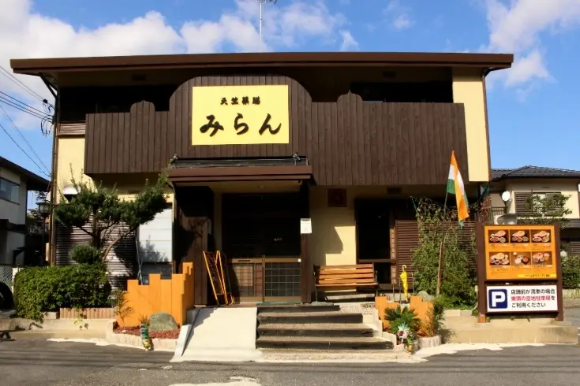

この記事では「せっかく菁々祭に来たのにどこを回ればいいのかわからない」「回りたい場所があったのに混んでて全然楽しめなかった」といったあるあるを解消すべく、同好会の展示を知り尽くしている（はずの）僕がおすすめの回るルートや展示を紹介していきます！

# 目次

# 菁々祭を10倍楽しむための2つのウラワザ!

記事要約でも書きましたが、「せっかく菁々祭に来たのにどこを回ればいいのかわからない」「回りたい場所があったのに混んでて全然楽しめなかった」はもったいない！ということでこの記事を読んでくださる皆さんに東大寺学園生だから知ってるウラワザを紹介します！

## ウラワザ1 えっ！？この人気展示が並ばずに体験できる？！

1つ目からアヤしい書き方になってしまいましたが、このウラワザを使えばほぼ「確実」に行きたい場所に行くことが可能です。

そのウラワザとは...

「開始直後に行く」事です！

えっ...それだけ...？って思うのもわかりますが、本当にこれだけで大丈夫なんです！ 一番人が集まる時間、所謂ゴールデンタイムは11時～13時で、この時期は一般のお客さんが多く、人気のある展示の整理券は1時間待ち...なんてことが多発します。後述するウラワザ2の為にも是非とも9時ごろのご来校がおススメです!

ウラワザ2 うわっ...このカレー、美味しすぎ？

文化祭と言うといろんな出店が出て学生が料理をふるまう...というイメージを持たれる方もいらっしゃると思いますが、菁々祭はコロナの流行以後、食品関係が減ってしまいました。 とはいっても腹が減っては戦ができぬ。ということでウラワザ2では 「東大寺学園生からも人気で」「近場で」「コスパ最強の」「激うまランチ」を紹介したいと思います！

その店とは...

## 天竺薬膳 インド料理 みらん 高の原店

価格帯は900円～2000円で学校徒歩3分にあるのもおすすめポイントです!

# 作者イチオシの同好会展示3選!

ここでは、「菁々祭に来たはいいものの、よくわからないからここに行ってみよう～はもったいない！」というのを指針として、人気な展示や混雑度がそこまで高くないがレベルが高い展示を紹介していこうと思います！

## その1 MGA同好会

MGA同好会という名称では、どのような活動をしているのかが分からないという方が大半でしょうが、部員自作のボードゲームや部誌の配布、今年は推理とロールプレイで謎を解くマーダーミステリーというゲームの「マーダーミステリー体験　菁々殺」を体験することができます。 この同好会の一番の魅力は「体験できるものが多く、全然飽きない」という点に集約されます！ ふだんからボードゲームをしてどうすれば面白いものを作れるのかと考えている人たちの集大成を是非遊んでみてください！

去年の文化祭での部員の自作ボードゲームの様子

## その2 情報研究部

情報研究部は数年前に部に昇格した同好会で、展示内容はプログラミング体験にロボホン体験、部員がプログラムしたゲームのプレイがあげられます。

情報研究部をおススメする理由は「混雑度と面白さがいい意味で釣り合っていない」という点にあります！ゲームのクオリティはどれもハイレベル、プログラミングもかなり発展的なことができるので、是非行って見てください

## その3 クイズ研究部

同好会展示の華はクイズ研究部と言わんばかりの盛況具合で、早押しボタンでできるクイズ体験が大人気です。

# 作者的最強ルート！

ここでは先程紹介したウラワザと、おススメの同好会展示を組み合わせた最強ルートを滞在時間別に2つ紹介していきたいと思います！（タイムテーブルは去年の物で考案しているので、多少変わる可能性がありますのでご了承ください。）

## 3時間ルート ～最小限の時間で最大限の体験を～

9時　　到着

9時5分　　プログラミング教室の整理券入手

9時10分～9時半　　MGA同好会

9時半～9時50分　　クイズ研究部

10時～11時　　プログラミング教室

11時～12時　　自由枠

このルートの一番の魅力は回る時間こそ短いものの回れる展示の数が多く、人気で整理券が取りにくいプログラミング教室が入っているのが特徴です。 菁々祭に行きたいけど時間がない！って人におすすめです。

## 6時間ルート ～ゆったり、でも超満喫！～

9時　　到着

9時～9時半　　クイズ研究部

9時半～10時　　情報同好会

10時　　お化け屋敷の整理券入手

10時～10時半　　MGA同好会

10時半～10時50分　　自由枠（グラウンドの屋台がおすすめ！）

11時～11時50分　　お化け屋敷

12時～13時　　みらんで昼食

13時10分～13時半　　グラウンドの屋台

13時半～15時　　自由枠（音楽部ライブがおすすめ！）

このルートの魅力と言ったらなんと言ってもその拡張性の高さです。プログラミング教室と同等、あるいはそれを超える混雑度のお化け屋敷をルートに入れているのも特徴です。ですがウラワザ1を有効活用。お化け屋敷の整理券を比較的簡単に入手出来ちゃいます!

# まとめ

いかがでしたか？短い記事になってしまいましたが、この記事によって皆さんがもっと菁々祭を楽しめるようになったら幸いです。それではまた9月7・8日に会いましょう！ここまで読んでいただきありがとうございました!
