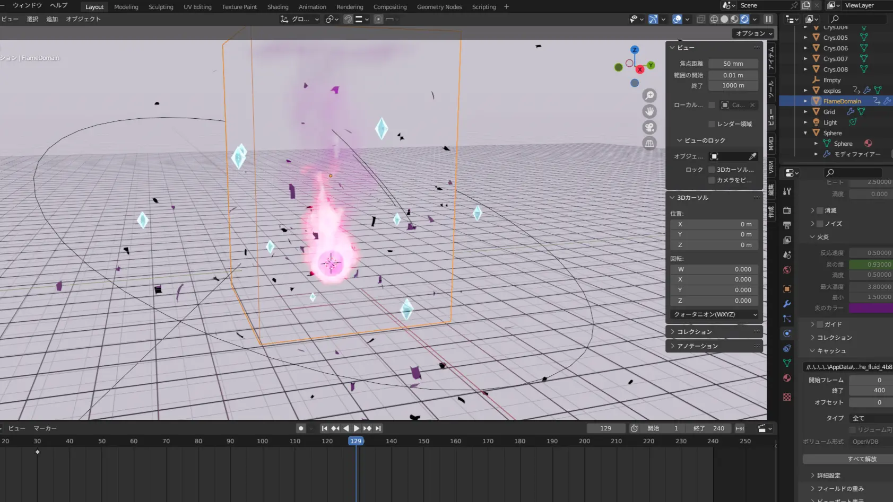

今や菁々祭に火を点けるビッグイベントとなったテーマ・ロゴ発表。今年も例年以上に大きな反響を得ました。今回はそんなレベルの高い動画を出し続ける動画制作陣に話を伺います。

テーマ・ロゴ発表映像はこちらから→

[https://youtu.be/4h_s7_eRCo0](https://youtu.be/4h_s7_eRCo0)

# 目次

# Q.テーマ・ロゴ発表動画の制作の流れについて教えてください

発表映像の制作に携わったのは主に2人で、BGMの選曲、モーショングラフィックス、3DCG等を担当した自分と、ロゴデザインやグラフィック担当の相方です。

今回使用したソフトは、Adobe After Effects (モーション用)、Adobe Illustrator (グラフィック用)、Blender(3D表現用)です。

作業工程としては、Illustratorで動かす図形や文字を配置する→Illustratorで作った素材をAfter Effectsに取り込む→After Effects で図形や文字にモーション（動き）を付ける、それに加えて3Dの背景など（複雑なもの）はBlenderで作る、といった感じです。Adobeのソフトを本格的に使うのは初めてだったので結構苦戦しました。

# Q.今回の動画で拘ったところはありますか？

最初のピンクの炎が燃え続ける部分ですね。Blenderというソフトを使い、炎を流体シミュレーションを、空中に舞う埃をパーティクルシステムを使って作っています。

TwitterやInstagramなどに投稿する際、最も多くの人がプレビューで初めに目にするところなので、興味を持ってもらえるようかっこよく作ろうと思いました。 あと選曲もこだわりました。僕は大のフリーBGMマニアなので沢山の選択肢があって迷いました。

(彼のYouTube再生リストには2000を超えるフリーBGM動画が保存されているとかいないとか。引き出しの量が恐ろしいです…)

Blenderの編集画面

# Q.逆に難しかったところはありますか？

難しかったというより辛かったのは発表の前日時点で動画の編集が全然終わってなくて、徹夜して作るしかなかったことですね。動画はロゴ発表当日の朝5時に完成しました。 眠気と疲労がひどくてその日は意識が朦朧としてました。

# Q.動画作成に興味を持ったきっかけとかはありますか？

小学生の頃に動画サイトでMAD動画や組曲動画を見て自分も作ろうと思って始めました。 いわゆる「ゆっくり実況」動画とかも結構作ってました。

# Q.来年以降テーマ・ロゴ発表を作る後輩たちに一言お願いできますか？

計画性を持って頑張って早めに完成させるのがやっぱり一番理想的だなと思いました。動画編集に携わった人間として納期ギリギリになってしまう気持ちは身にしみてわかるのですが...

After Effects の編集画面。非常に複雑。

# おわりに

制作陣の並々ならぬ努力がうかがえましたね。

他にも制作陣の拘りポイントが多くあるらしいので、皆さんも探してみてはいかがでしょうか？？
