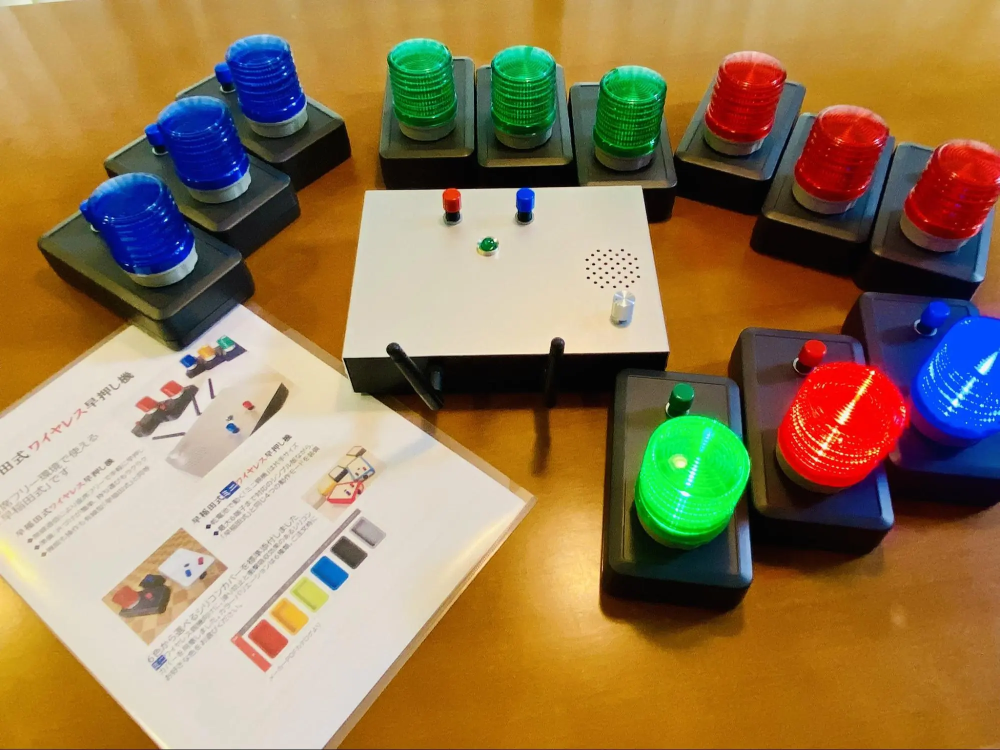

昨年、「高校生クイズ」や「東大王」で優勝した強豪・クイズ研究部。このブログではそんなクイズ研究部の見どころや実に 5 年ぶりの開催となる〇〇〇〇について、今回副部長に独占取材！ 徹底的にその実態を解剖します！！

# 目次

# そもそも東大寺学園クイズ部とは？

## 「日々の活動だったり、雰囲気や特徴を教えてください！」

「基本的に毎日放課後に部員で早押しクイズをしています。よくテレビで見る早押しボタンを使ってます！部活の雰囲気が厳しいとか全然なくて、行きたい人が行く～って感じなんで、普段は別の部活で活動してるけど息抜きで来るって人もいます。 」

「特徴といえばやはり熱心に活動する人が多いと思います。クイズ強い人なんかは部活はもちろん電車や家でクイズの問題集を読み込んだり Anki っていう暗記専用アプリを使って座学に励んでます。」

普段の活動で使用してる早押し機。73 期の方がテレビ番組「東大王」で優勝した際に景品として頂いた大切なもの。

# 文化祭の教室展示について

## 「上の写真は去年の様子らしいですね、詳しく教えてください！」

「右の方に見える賞状は AQL\*1 という大会で優勝した時の物です。けど最後に全国優勝したのが 3 年前で当時の優勝メンバーもほとんどいなくなってしまったのでそろそろ優勝したいですね。 左の方にあるサイン色紙は QuizKnock の伊沢さんや鶴崎さんのサインです。過去に先輩が QuizKnock 主催の大会「WHAT」で優勝した時に頂いたものを展示しています。」

## 「なるほど、その他に教室で行ってることはありますか？」

ペーパークイズと早押しクイズ体験を行っています。ペーパークイズは部員が懸命に作った問題を解くことができます！点数が高かった人にはちょっとした景品があります。早押しクイズ体験では、部員が実際に使ってる早押し機を用いてクイズをすることが出来ます！なかなかすることが出来ない貴重な体験ですのでぜひ一度押してみてください！」

＊１ AQL…中高生による学校別クイズ団体戦。毎年春に東京で決勝大会が開かれる。クイズ界の甲子園的な立ち位置の大会。

# 5 年ぶりとなる〇〇〇〇？！？！

## 「今年、クイ研さんが何か企画すると噂に聞いたことがあるんですが...」

「今年、関西のクイズ強豪校を文化祭に招待して東大寺学園クイズ研究とガチガチクイズバトルを行います！前回がコロナ前の 2019 年に行われたので、実に 5 年ぶりの開催となります。今のところの参加予定校は、東大寺・灘・西大和・大阪星光の四校です。実は同じメンバーで今年の 5 月、灘校文化祭で同様の招待試合があったのですが、その時は惜しくも西大和に優勝を譲ってしまいました。今回は東大寺勢が活躍してくれるといいですね！詳しくは東大寺学園クイズ研究部の Twitter・X（＠TDJquiz)で告知するので、ぜひフォローしてください!」

今年 5 月、灘で行われた招待試合の様子。めっちゃ盛り上がってたので東大寺でもみんなが楽しめる企画にしたいと副部長は語る。

# 来場者に向けて一言

## 「最後に、来場者に向けて一言お願いします！」

「今年は例年よりさらにレベルアップした展示が出来るように頑張ります！特に目玉の招待試合では関西のクイズ猛者たちによる激戦を見ることができますので、ぜひお越しください！！我々クイズ研究部も昨年同様様々な大会で活躍する姿を皆様に届けられるよう日々努力しますのでよろしくお願いします！！」

いかがだったでしょうか？例年よりクオリティの上がったクイズ研究部の展示が楽しみです！

取材協力：クイズ研究部副部長
