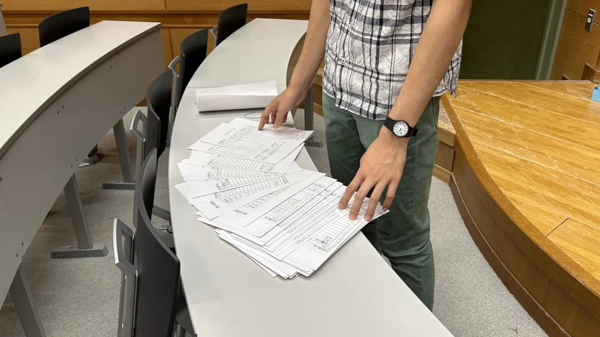

この大規模なイベント、菁々祭の予算折衝など重役を担う会計パート。本ブログではそんな会計パートについてどんな団体がどのように仕事をこなしているのか、会計パート長に協力してもらいながら紹介していこうと思います。

# 目次

# 予算総額と配分

## 「予算の配分はどのように決定しましたか？また、優先順位はどのように設定しましたか？」

「総額は大体 X00 万円程度。無駄なところを省いていくと意外と 2、30 万は残る。あと、パートの予算よりも文化部・同好会を優先してる。見栄えが一気によくなるロゴモニュメントや門にも大きな額をあげている。」

主に、鉄道研究部のジオラマなどはクオリティ相応の金額がかかるので、満額回答しているとのこと。また、門セクションのモニュメントも非常にインスタ映えが期待できるのでぜひ見ていってほしいです。(完成が文化祭最終日になることが多々ありますが)

# 出費の管理

## 「予算オーバーにならないように、どのような対策を講じていますか？また、団体から業者変更の依頼はどう対処していますか？」

「購入する業者は選んでいます。印刷用紙の費用はそれで 10%減できました。『こっちの業者の方が安く済むんじゃないの』という議論については、めんどくさかったのでしてませんでした(笑)。ですが、クラブによって『○○ メーカーの素材でなければならない』というこだわりがあるので、そこは守っています。」

# 予算の削減について

## 「出し物の中で、どの部分の予算を削減することができると考えていますか？」

「部誌を重点的に削っています。具体的には、オンライン化、あるいはクイズ等に置き換えたりしています。また、去年と比較して明らかに予算が高いところは、意外とその費用が必要だったりするのでよく話し合っています。」

# 費用の見直し

## 「予算内に収まらない場合、どのように調整を行っていますか？」

「基本的にはパートから削っています。PR・イベント・装飾の 3 パートで、会計パート長が指定した限度額に収まるように罵声大会を開催しています(笑)。」

# 報告とコミュニケーション

## 「役割の分担についてはどのようにしていますか？」

「重い部活やパートはパート長が、その他は他のパート員が担当しています。」

## 「ぶっちゃけ、会計パート長が所属している団体などの予算は贔屓したりしていますか？」

「予算案がまだ決まっていないので… 」

とのことです。恐らく贔屓はないでしょう！

大量の予算申請書に頭を悩ませる会計パート長

# まとめ

いよいよ近づいてきた文化祭！多くの「楽しい」を提供するイベントの裏にはこのような努力が隠れています。この努力の成果を見て行ってほしいので是非お越しください！

ここまで読んでいただきありがとうございました！
