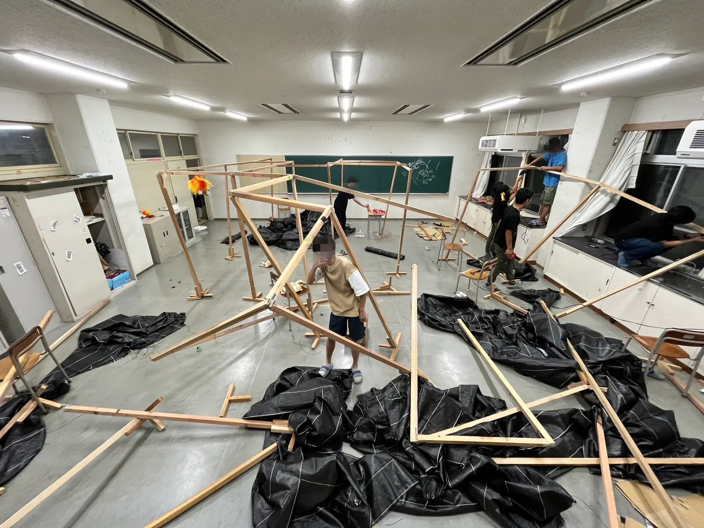

この記事では「せっかく菁々祭に来たのにどこを回ればいいのかわからない」「回りたい場所があったのに混んでて全然楽しめなかった」といったあるあるを解消すべく、同好会の展示を知り尽くしている（はずの）僕がおすすめの回るルートや展示を紹介していきます！

# 目次

# お化け屋敷セクションについて

## 「お化け屋敷セクションについて教えてください。」

「 お化け屋敷は、夏休みを中心にお化けを作って、当日お化け役としてお客さんを怖がらせるのがメインの仕事になります。」

## 「何人ぐらいいるんですか？」

「セクション員は大体四十人くらいいます。」

# セクション長の紹介

## 「いつからセクションに入っているんですか？」

「僕は中三からお化け屋敷セクションに入っていて、最初は友達に勧められて入りました。」

## 「どのように進めていきたいですか?」

「一年目の先輩も二年目の先輩も滅茶苦茶優しくいろいろ教えてくれたので、僕もそういう風に仲良くやっていけたらなと思います。」

# Q.菁々祭の中でお化け屋敷はどのようなコンテンツだと思っていますか

「あんまり注目されることは少ないですけど、毎年整理券はすぐ売り切れるし、とても人気だと思います。だからこそ、高いクオリティのものを作らないといけないし、そこは気を引き締めてやらなきゃいけないな、と思います。」

木材を一から組み立てていく

# Q.具体的に夏休みの作業の概要を教えてください

「設計は基本的にもう決まっているので、それに合わせて木を指定された長さに切って、後半はそれを組み立てていって、参加者が進むルートをつくる、という感じです。」

# Q.去年大変だったことは何でしょうか

「I字金具が全然なくてＬ字金具を無理やりハンマーでぶったたいてI字金具にした作業がしんどかったですね。」

## 「それは校舎統括パートのミスだったんですか？」

「そうですね。あれは舎括の発注が全然なかったとかで…。そういうのがたいへんだったっていうのはあります。」

# Q.逆に嬉しかったことは何でしょうか

「終わった後、食べたラーメンがおいしかったです(笑)。

まあでも、毎年だけど、お客さんが来てくれて、すごく怖がったりしているのを見ると、楽しいというか、嬉しいですね。」

お化け屋敷建設中

# Q.今年のお化け屋敷の去年と違うところ、見どころを教えてください

「お化けって普通お面をかぶって怖がらせるんですが、まだ色々考えてるところではありますが、怖がらせ要員を増やすかな、っていうのはあります。」

# Q.最後に、来場者に向けて一言お願いします

「絶対楽しいお化け屋敷にするので、来てくれたらうれしいです！」

# おわりに

いかがだったでしょうか。今年度のお化け屋敷もとても面白そうですね。ぜひ皆さん菁々祭に来てくださった際にはぜひお化け屋敷に行ってみてください。整理券を忘れずに。最後にこの記事に関わってくださった皆さんありがとうございました。
