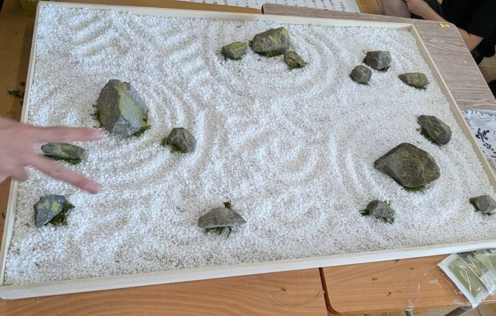
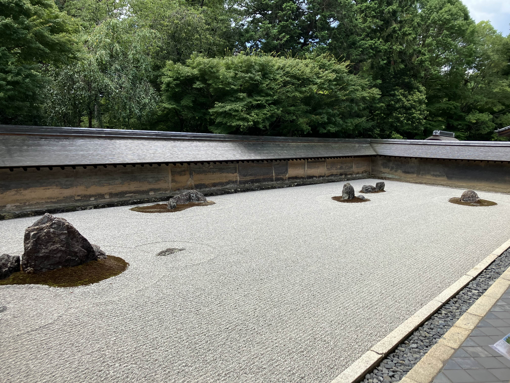
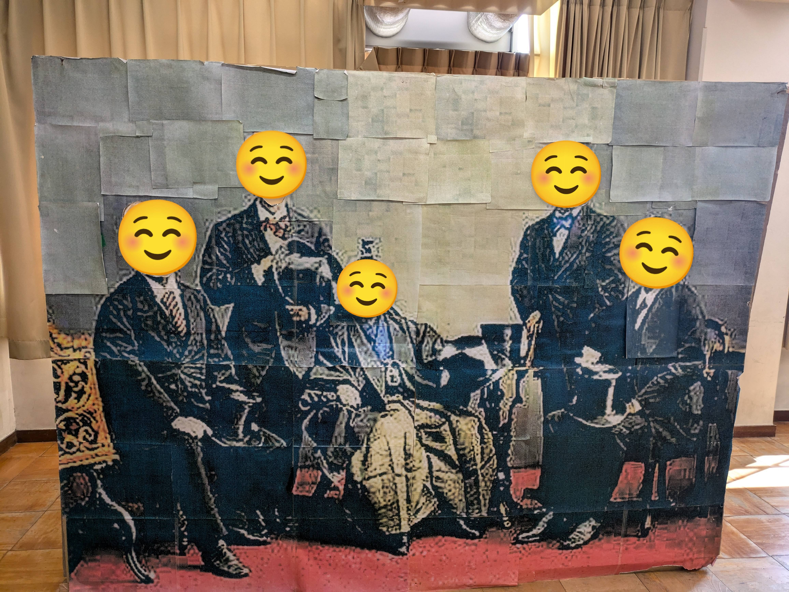
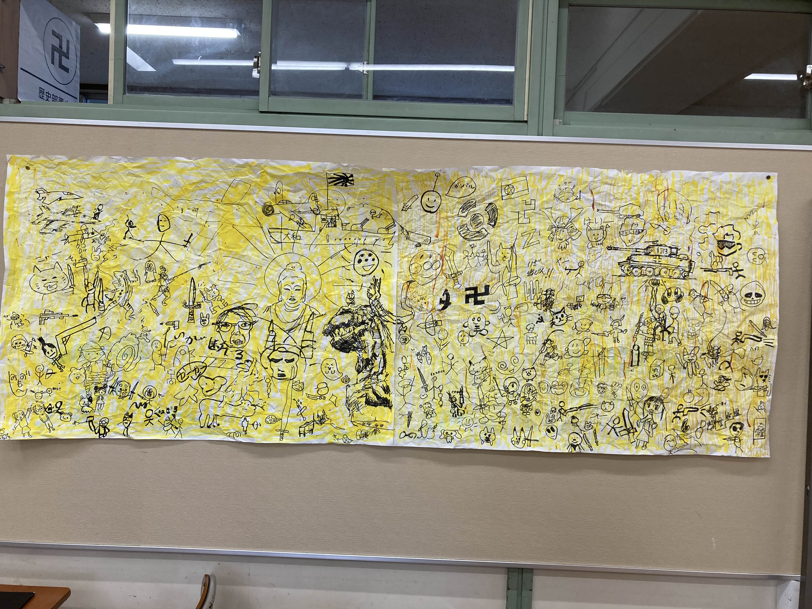
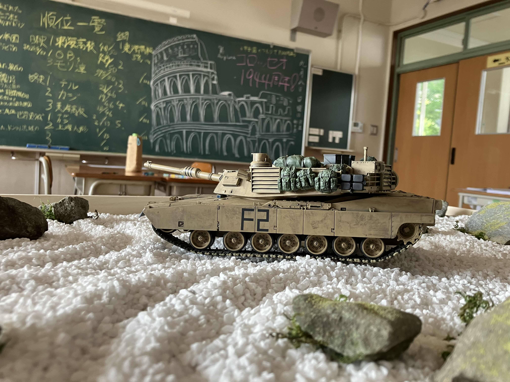
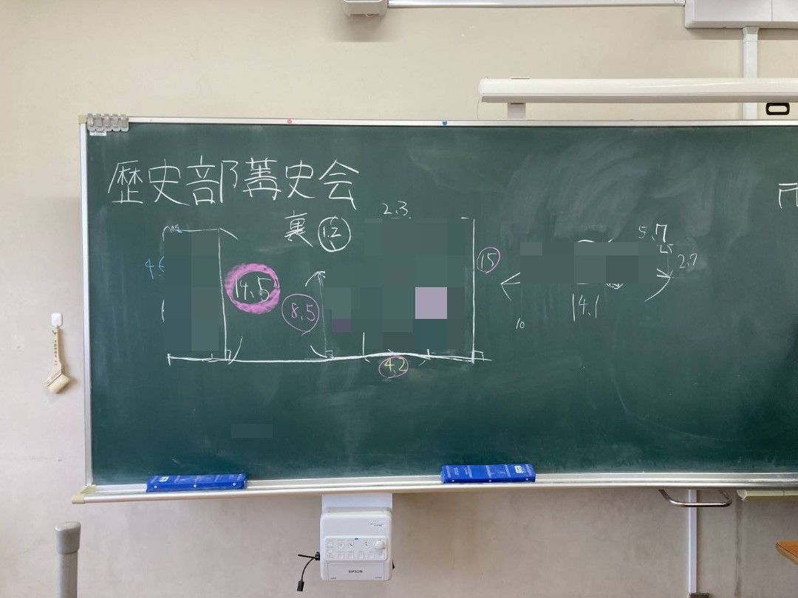

現存する部活の中で最も歴史があり、最も歴史に近いこの部活。そんな歴史部の今年の文化祭展示準備がどのように進められているのかを探ってきました。

# 目次

# 去年の文化祭展示を振り返って

去年、ありがたいことに、多くの方々に歴史部の展示へと足を運んでいただきました。

そんな大盛況を呼んだ展示を見ていきましょう。

歴史部の去年の展示の目玉は枯山水(かれさんすい)！！石のみをつかった室町時代の美。白い小石は深浅で水の流れを表しており、このことから「枯山水」の名がつけられました。黒い大きな石は、モデルにした龍安寺の枯山水と同じ配置になっています。

↑龍安寺の枯山水。この中庭に面した廊下のどの角度から見ても、１５個の黒い石のどれかが他の石に隠れてしまい、１５個の石すべてを一度に見ることができなくなっています。１５という数字は東洋では「完全」を意味する反面、すべての石が一度に見られない「不完全」さを持つ。味わい深いですね。

後は岩倉使節団の顔はめパネルがあったり…

「みんなで作る合戦絵巻」のコーナーがあったり…

とても賑やかで楽しい展示ができたんじゃないかと思っています！

↑文化祭終了後。部員数名による戦車と枯山水の夢のコラボレーション(？)

## 今年の文化祭展示について

本題と内容が合ってないじゃないか！今年の情報が欲しいんだよ！と思った方、すみません。しかし！一般部員である僕から最大限情報を伝えさせていただきます。今年のメイン展示は…

○○○○の○○です！今大注目のアレと名前が似ているところに建っているアレですよアレ！

答え合わせは文化祭で！ぜひ部員の愛が詰まった歴史部を覗いてみてください！
