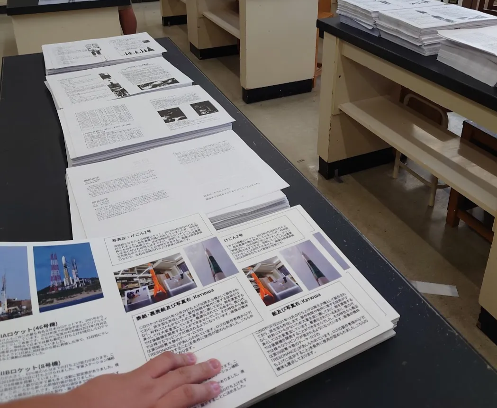

全国でも数少ないロケット研究部その謎めいた実態を部長に取材してみました！　

# 目次

# そもそもロケット研究部とは？

### 普段の活動や雰囲気について教えて下さい!!

「普段は月一くらいの頻度で発射実験を行っており、できるだけ高く飛ばせるように日々研究と実験を繰り返しています。部員間も仲がよく、縦の繋がりがとても強いように感じます（僕自身後輩からあまり敬語を使ってもらっていません( ；∀；)」

# 文化祭への準備

### 毎年文化祭に向けてどんな準備をしているんですか？

「宇宙に関する大型展示を行っています。2年前はJAXAのHⅡロケット、昨年は宇宙探査機はやぶさ2（下写真）を展示しました。我々ロケット研究部の教室展示のメインとなっています。例年は夏休みの始まりとともに作業を始めていますが、今年はもう少し余裕を持たせたいですね（笑）　今年の展示について？それはまだお答えすることはできませんが、今年も部員一同の総力を結集して素晴らしいものを作りたいと思います。」

↑大型展示物に使うプラスチックダンボールを加工する様子

↑昨年の大型展示　宇宙探査機はやぶさ2の2分の1スケール

### やっぱりロケット研究部といえば部誌ですよね！

「毎年部員それぞれが興味のあるロケット（宇宙）に関する分野を寄稿してくれています。中には10ページを超える文量の記事まであるので相当な熱量です。すべての記事の編集を終え、9月に入ると製本作業を行います。毎年数百部を刷っているのでかなりの作業です。多くの部員を動員して夜まで作業をします。みんなの気が狂ったように作業をする雰囲気が僕は文化祭の準備のなかで一番好きですね」

↑部誌の製本作業の様子

# 今年の文化祭展示

### 今年、ロケ研で新たな取り組みをすると聞いたのですが…

「今年は今までの発射実験や大型展示も行いながら、ロケットの制作体験を本格的に実施しようと思います。僕たちが実際作っているロケットと同じものを作ってもらう体験です。昨年も小規模ながら制作体験を行いましたが、今年はより体験が思い出に残るような工夫をしますので、ぜひ遊びに来てください！」

# 来場者の方々に一言

### 最後に、来場者に向けて一言お願いします！

「今年は例年以上に気合の入った展示をお見せできるよう頑張ります！迫力満点の発射実験や部員たちのこだわりが詰まった大型展示、そして皆さんに楽しんでいただけるような制作体験をお届けしますので、ぜひお越しください!!」
