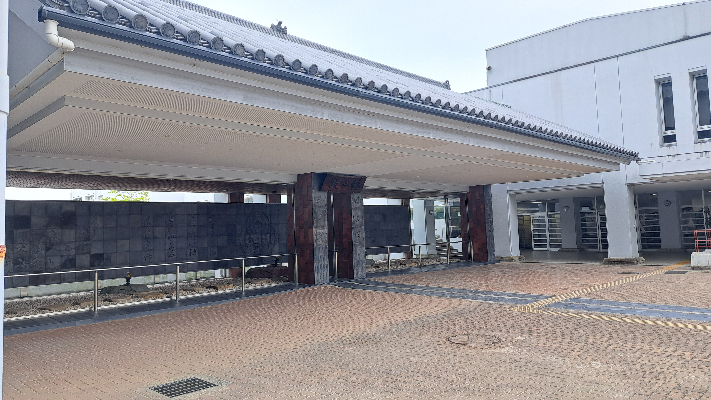
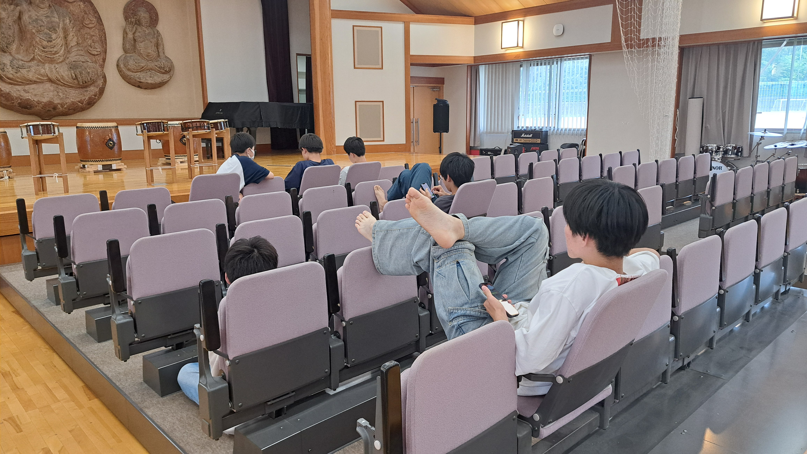
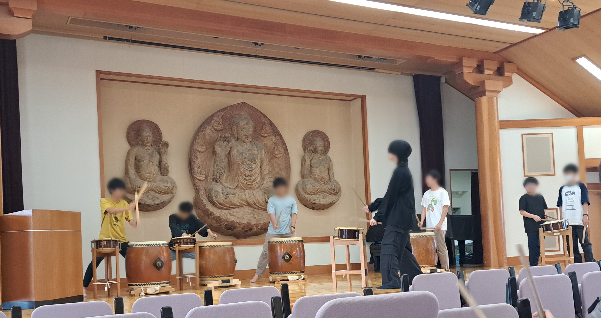
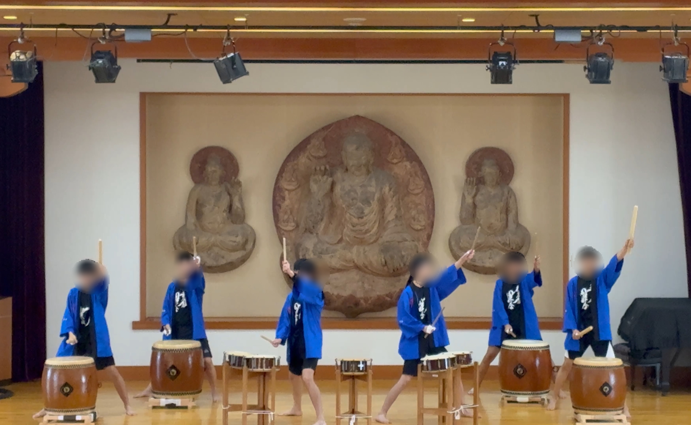
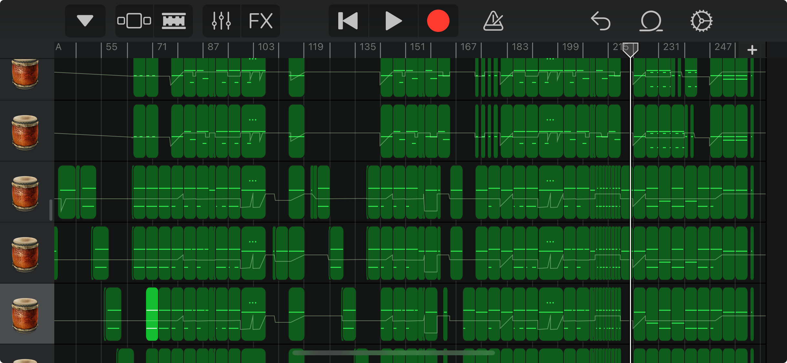

あなたが菁々祭にお越しになった当日、門をくぐって最初に見る景色とは一体なんでしょうか？バザー？ロゴモニュメント？はたまたパンフレット？**そうです、「和太鼓演奏」ですね。**そんな和太鼓演奏について、和太鼓同好会に話を伺いました！

# 目次

# 和太鼓演奏ってそもそもなんですか？

## 菁々祭の華です。

大げさではありません。

和太鼓演奏は、東大寺学園のいわゆるロビーのような場所にあたる**転心殿**の目の前で毎年開催されます(ちなみにインフォメーションセンターもこの転心殿前にあります)。校門を通ってから各教室に向かうには必ずここを通る必要があり、**毎年たくさんの人が和太鼓演奏に集まる**、というわけです！

ここが「転心殿」。東大寺の大仏にゆかりがある神聖な場所

# 和太鼓同好会ってふだん何してるの？

さて、そんな華の和太鼓演奏を行っている和太鼓同好会ですが、どんな部活でどんな練習をしているのでしょうか？もしかしたら運動部も顔負けの筋トレを毎日行っているのかも……

好奇心を胸に秘めたまま練習場所の圓融館ホールのドアを開けてみました、すると……

思わず「練習しろよ……」と言いたくなるような光景

## 全員、スマホを見て座ってますね。

どうやらイメージとは裏腹に、すごくゆるい部活のようです。と思ったのも束の間、ちょうど休憩の時間だったようで、部員の一人が不意に太鼓を叩き出すと他の部員も練習を始めました……

練習風景、かっこいい……

最初は一人で勝手に叩いていたのが、他の部員によってパートが補完され、徐々に完成に近づいていくのを見ると、**思わず鳥肌が立つような迫力に飲み込まれてしまいました……**やはり実際に聴くと太鼓の音色が胸に響きますね。

# 「数年ぶりの新曲です！」

演奏を聞いて胸を躍らせたところで、副部長さんに**インタビュー**をすることにしました(以下、副部長さんを**N**とします)。

左がNさん、右は会計のKさん

「はじめまして！すごい演奏でびっくりしました……」

**N**「ありがとうございます〜」

「ここの部員数は何人ですか？また週に何回練習されているんですか？」

**N**「19人で、月曜日と木曜日の週２回練習しています。」

「いま演奏した曲はなんという曲ですか？」

**N**「『**颯**(はやて)』という曲です！ **ぼくが作曲して** 高校２年生だけで練習した **数年ぶりの新曲です！** 」

『颯』演奏風景

「すごい……今年の見どころはなにかありますか？」

**N**「今年は、文化祭テーマ『**分秒**』にちなんだ**特別な演出**を用意し、またぼくらの引退年ということでいつも以上に張り切って演奏したいと思っています！」

# 新曲は「スマホで作曲」

「新曲についてもっと深く教えていただいても……？」

**N**「もちろんです！いま作っている曲は『颯』を含めすべてiPhoneのGarageBandという無料のアプリで**１から作曲しています。**これまでの曲は既存の曲を模倣して使い回してきたのですが、今年**初めて完全なオリジナル曲を演奏します！**」

新曲「颯」の譜面。とても刻まれています

「なるほど！ちなみに大会などには出る予定はありますか？」

**N**「**あります！**とはいえ、全国的に見ればまだまだ未熟なので後輩たちにはがんばってほしいです。」

「ありがとうございます！最後に、菁々祭に来場する皆さんに発信したいことはありますか？」

**N**「『**塵すら踊らせ、打ち鳴らせ。**』(第57回菁々祭より)」

Nさん、ありがとうございました！

# おわりに

最後までお読みいただきありがとうございます！

この記事を読んで少しでも和太鼓演奏や菁々祭に興味を持っていただければ幸いです、菁々祭にお越しになった際にはぜひ和太鼓演奏をご観覧ください！
