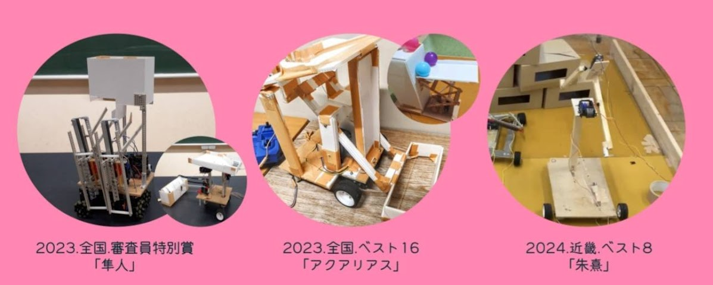
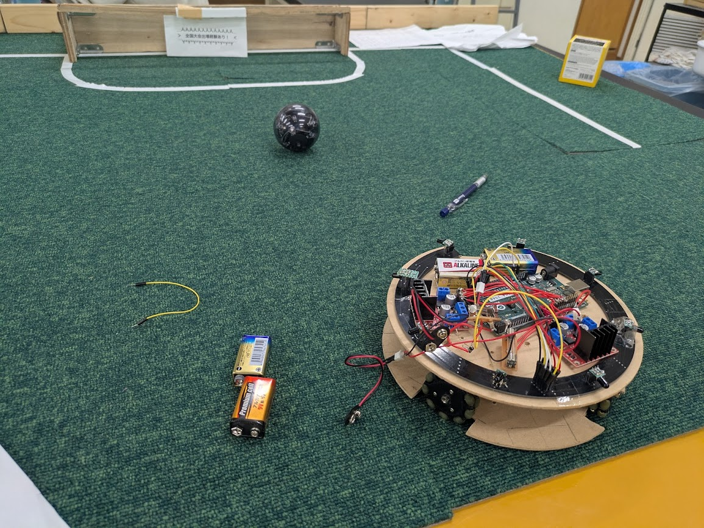
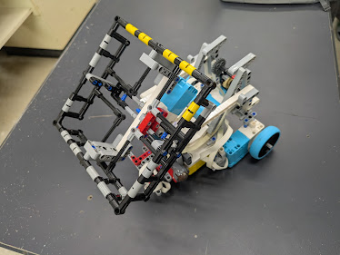

例年たくさんのお客さんでにぎわう電子工作部ですが、普段はどういった活動をしているのでしょうか？今年予定されている展示の紹介と一緒にしていこうと思います。

# 目次

# 我が部で一番の実績を誇る、ロボコン部門

　東大寺学園電子工作部は、四つの部門に分かれています。まずはそのうちの一つであり、最も輝かしい大会実績を誇るロボコン部門から紹介していきます。

　ロボコン部門はみなさんがNHKで見たりするようないわゆる「電子工作」をする班です。自分たちで木材を切り、機体を組み立て、操縦します。全国大会でベスト16という輝かしい成績をのこし、電子工作部の発展に大きく貢献してきました。当日は、様々な機体を展示する予定です。機体がどのように動くかは、スタッフに聞くと熱心に解説してくれるはずなので、ぜひ聞いてみてください。

# 最も自由な制作活動をする、電子工作班

　電子工作班は文化祭に向けて活動する制作団体です。新入生へのはんだ付け体験を毎年行っており、当日はタッチセンサーを使ったもぐらたたきや、美しい図形を描く発光ダイオード群など魅力的な展示を多数作ってお待ちしているとのことです！

# ロボットでサッカー?!ロボカップ班

　「ロボカップは、ラジコンのような人の操作によって動くロボットではなく、自分で考えて動く自律移動型ロボットによる競技会。」（Wikipediaより）とあるように、ロボットたちのサッカー大会に出場しています。部室内の彼らのスペースには3Dプリンターがあり、新入生はよくそれを見て盛り上がります。ほかの部門よりも高度なプログラミングを用いて、勝ち上がるべく頑張っています新規部員絶賛募集中。当日はコートや機体の展示をする予定です。

# LEGOのプログラミング、いろんなアクティビティも！レゴ班

　レゴ班は、LEGO社が提供するモーターを使って毎年大会に出場しています。レゴの部品のみを用いて様々なミッションをクリアすることは、かなり変わっていて、おもしろく思うでしょう。文化祭のころには大会が終わり、きっといい結果をつかんでいる（はず）なので、機体がどんな動きをするのか聞いてあげてください！教室ではディスプレイの発光を応用したオセロや大会に出場した機体の展示を予定しています、ぜひお越しください！

　また、当日はモーターであるev3を用いたプログラミング講習会を開催予定です。整理券が必要になるので、参加を希望する場合は配布所に行くことを忘れないようにお気を付けください。

